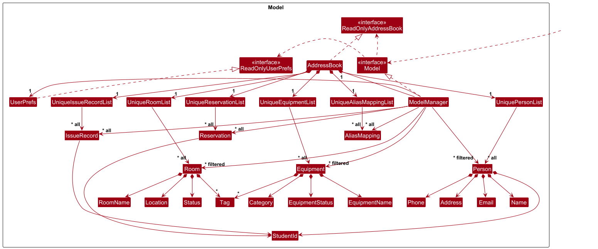

* Table of Contents
{:toc}

--------------------------------------------------------------------------------------------------------------------

## **Acknowledgements**
* This project is based on the AddressBook-Level3 project, **part of the se-education.org** [initiative](https://se-education.org/#contributing-to-se-edu)

* Libraries used: [JavaFX](https://openjfx.io/), [Jackson](https://github.com/FasterXML/jackson), [JUnit5](https://github.com/junit-team/junit5)

--------------------------------------------------------------------------------------------------------------------

## **Setting up, getting started**

Refer to the guide [_Setting up and getting started_](SettingUp.md).

--------------------------------------------------------------------------------------------------------------------

## **Design**

:bulb: **Tip:** The `.puml` files used to create diagrams are in this document `docs/diagrams` folder. Refer to the [_PlantUML Tutorial_ at se-edu/guides](https://se-education.org/guides/tutorials/plantUml.html) to learn how to create and edit diagrams.

### Architecture

The ***Architecture Diagram*** given above explains the high-level design of the App.

Given below is a quick overview of main components and how they interact with each other.

**Main components of the architecture**

**`Main`** (consisting of classes [`Main`](https://github.com/AY2526S2-CS2103T-T14-4/tp/blob/master/src/main/java/seedu/address/Main.java) and [`MainApp`](https://github.com/AY2526S2-CS2103T-T14-4/tp/blob/master/src/main/java/seedu/address/MainApp.java)) is in charge of the app launch and shut down.
* At app launch, it initializes the other components in the correct sequence, and connects them up with each other.
* At shut down, it shuts down the other components and invokes cleanup methods where necessary.

The bulk of the app's work is done by the following four components:

* [**`UI`**](#ui-component): The UI of the App.
* [**`Logic`**](#logic-component): The command executor.
* [**`Model`**](#model-component): Holds the data of the App in memory.
* [**`Storage`**](#storage-component): Reads data from, and writes data to, the hard disk.

[**`Commons`**](#common-classes) represents a collection of classes used by multiple other components.

**How the architecture components interact with each other**

The *Sequence Diagram* below shows how the components interact with each other for the scenario where the user issues the command `delete-s A1234567A`.

Each of the four main components (also shown in the diagram above),

* defines its *API* in an `interface` with the same name as the Component.
* implements its functionality using a concrete `{Component Name}Manager` class (which follows the corresponding API `interface` mentioned in the previous point.

For example, the `Logic` component defines its API in the `Logic.java` interface and implements its functionality using the `LogicManager.java` class which follows the `Logic` interface. Other components interact with a given component through its interface rather than the concrete class (reason: to prevent outside component's being coupled to the implementation of a component), as illustrated in the (partial) class diagram below.

The sections below give more details of each component.

### UI component

The **API** of this component is specified in [`Ui.java`](https://github.com/AY2526S2-CS2103T-T14-4/tp/blob/master/src/main/java/seedu/address/ui/Ui.java)

The UI consists of a `MainWindow` that is made up of parts e.g.`CommandBox`, `ResultDisplay`, `PersonListPanel`, `StatusBarFooter` etc. All these, including the `MainWindow`, inherit from the abstract `UiPart` class which captures the commonalities between classes that represent parts of the visible GUI.

The `UI` component uses the JavaFx UI framework. The layout of these UI parts are defined in matching `.fxml` files that are in the `src/main/resources/view` folder. For example, the layout of the [`MainWindow`](https://github.com/AY2526S2-CS2103T-T14-4/tp/blob/master/src/main/java/seedu/address/ui/MainWindow.java) is specified in [`MainWindow.fxml`](https://github.com/AY2526S2-CS2103T-T14-4/tp/blob/master/src/main/resources/view/MainWindow.fxml)

The `UI` component,

* executes user commands using the `Logic` component.
* listens for changes to `Model` data so that the UI can be updated with the modified data.
* keeps a reference to the `Logic` component, because the `UI` relies on the `Logic` to execute commands.
* depends on some classes in the `Model` component, as it displays `Person` object residing in the `Model`.

### Logic component

**API** : [`Logic.java`](https://github.com/AY2526S2-CS2103T-T14-4/tp/blob/master/src/main/java/seedu/address/logic/Logic.java)

Here's a (partial) class diagram of the `Logic` component:

The sequence diagram below illustrates the interactions within the `Logic` component, taking `execute("delete-s A1234567A")` API call as an example.

:information_source: **Note:** The lifeline for `DeleteStudentCommandParser` should end at the destroy marker (X) but due to a limitation of PlantUML, the lifeline continues till the end of diagram.

How the `Logic` component works:

1. When `Logic` is called upon to execute a command, it is passed to an `AddressBookParser` object which in turn creates a parser that matches the command (e.g., `DeleteStudentCommandParser`) and uses it to parse the command.
1. This results in a `Command` object (more precisely, an object of one of its subclasses e.g., `DeleteStudentCommand`) which is executed by the `LogicManager`.
1. The command can communicate with the `Model` when it is executed (e.g. to delete a student). 
   Note that although this is shown as a single step in the diagram above (for simplicity), in the code it can take several interactions (between the command object and the `Model`) to achieve.
1. The result of the command execution is encapsulated as a `CommandResult` object which is returned back from `Logic`.

Here are the other classes in `Logic` (omitted from the class diagram above) that are used for parsing a user command:

How the parsing works:
* When called upon to parse a user command, the `AddressBookParser` class creates an `XYZCommandParser` (`XYZ` is a placeholder for the specific command name e.g., `AddStudentCommandParser`) which uses the other classes shown above to parse the user command and create a `XYZCommand` object (e.g., `AddStudentCommand`) which the `AddressBookParser` returns back as a `Command` object.
* All `XYZCommandParser` classes (e.g., `AddStudentCommandParser`, `DeleteStudentCommandParser`, ...) inherit from the `Parser` interface so that they can be treated similarly where possible e.g, during testing.

### Model component
**API** : [`Model.java`](https://github.com/AY2526S2-CS2103T-T14-4/tp/blob/master/src/main/java/seedu/address/model/Model.java)

The `Model` component,

* stores the address book data i.e., all `Person` objects (which are contained in a `UniquePersonList` object).
* stores the currently 'selected' `Person` objects (e.g., results of a search query) as a separate _filtered_ list which is exposed to outsiders as an unmodifiable `ObservableList<Person>` that can be 'observed' e.g. the UI be bound to this list so that the UI automatically updates when the data in the list change.
* stores a `UserPref` object that represents the user’s preferences. This is exposed to the outside as a `ReadOnlyUserPref` objects.
* does not depend on any of the other three components (as the `Model` represents data entities of the domain, they should make sense on their own without depending on other components)

### Storage component

**API** : [`Storage.java`](https://github.com/AY2526S2-CS2103T-T14-4/tp/blob/master/src/main/java/seedu/address/storage/Storage.java)

The `Storage` component,
* can save both address book data and user preference data in JSON format, and read them back into corresponding objects.
* inherits from both `AddressBookStorage` and `UserPrefStorage`, which means it can be treated as either one (if only the functionality of only one is needed).
* depends on some classes in the `Model` component (because the `Storage` component's job is to save/retrieve objects that belong to the `Model`)

### Common classes

Classes used by multiple components are in the `seedu.address.commons` package.

--------------------------------------------------------------------------------------------------------------------

## **Implementation**

This section describes some noteworthy details on how certain features are implemented.

### Add Student Feature

#### Overview
The Add Student command allows Facility Manager to record a new student profile in the database by specifying their name, matriculation number, phone number, and email. It is facilitated by `AddStudentCommand` and its corresponding parser `AddStudentCommandParser`.

#### Implementation Details
The implementation follows the **Command Pattern**, involving the following key components:

* `AddStudentCommandParser`: Responsible for parsing the user input and validating the presence of required prefixes.
* `AddStudentCommand`: Contains the execution logic, ensuring the student is unique before addition.
* `Person`: The entity that encapsulates student data (`Name`, `StudentId`, `Phone`, and `Email`).

#### Design Considerations
One of the noteworthy details in the implementation is the Defensive Validation in the execution stage:

**Parsing Stage**: The parser uses an `arePrefixesPresent` method to ensure that all mandatory prefixes (`n/`, `m/`, `p/`, and `e/`) are present and of the correct data format. If any are missing or if there is an invalid preamble, a `ParseException` is thrown.

**Execution Stage**: Performs a check against the existing database to prevent duplicate entries based on Student ID, Phone, or Email.

#### Execution Workflow
1. The Facility Manager enters a command as such:
`add-s n/John Doe m/A0123456B p/91234567 e/e0123456@u.nus.edu`.
2. `LogicManager` calls `AddressBookParser#parseCommand()`.
3. An `AddStudentCommandParser` is instantiated to tokenize the arguments. The parser uses `ArgumentTokenizer` to verify that all required prefixes (`n/`, `m/`, `p/`, `e/`) are present.
4. A `Person` object is created and wrapped inside a new `AddStudentCommand`.
5. The `LogicManager` calls `AddStudentCommand#execute()`.
6. The `Model` is checked for existing students with the same identity (e.g., same Matric Number, phone number, email).
7. If unique, the `Model` is updated, and a `CommandResult` is returned to the UI.

 **Note**: The lifeline for AddStudentCommand should technically end with a destruction marker (X) immediately after it returns the CommandResult. Due to the layout engine limitations of PlantUML, the lifeline may appear to continue to the bottom of the diagram, but the object is functionally disposed of after execution.

### \[Proposed\] Undo/redo feature

#### Proposed Implementation

The proposed undo/redo mechanism is facilitated by `VersionedAddressBook`. It extends `AddressBook` with an undo/redo history, stored internally as an `addressBookStateList` and `currentStatePointer`. Additionally, it implements the following operations:

* `VersionedAddressBook#commit()` — Saves the current address book state in its history.
* `VersionedAddressBook#undo()` — Restores the previous address book state from its history.
* `VersionedAddressBook#redo()` — Restores a previously undone address book state from its history.

These operations are exposed in the `Model` interface as `Model#commitAddressBook()`, `Model#undoAddressBook()` and `Model#redoAddressBook()` respectively.

Given below is an example usage scenario and how the undo/redo mechanism behaves at each step.

Step 1. The user launches the application for the first time. The `VersionedAddressBook` will be initialized with the initial address book state, and the `currentStatePointer` pointing to that single address book state.

Step 2. The user executes `delete-s 5` command to delete the 5th student in the address book. The `delete-s` command calls `Model#commitAddressBook()`, causing the modified state of the address book after the `delete-s 5` command executes to be saved in the `addressBookStateList`, and the `currentStatePointer` is shifted to the newly inserted address book state.

Step 3. The user executes `add-s n/David …​` to add a new student. The `add-s` command also calls `Model#commitAddressBook()`, causing another modified address book state to be saved into the `addressBookStateList`.

:information_source: **Note:** If a command fails its execution, it will not call `Model#commitAddressBook()`, so the address book state will not be saved into the `addressBookStateList`.

Step 4. The user now decides that adding the student was a mistake, and decides to undo that action by executing the `undo` command. The `undo` command will call `Model#undoAddressBook()`, which will shift the `currentStatePointer` once to the left, pointing it to the previous address book state, and restores the address book to that state.

:information_source: **Note:** If the `currentStatePointer` is at index 0, pointing to the initial AddressBook state, then there are no previous AddressBook states to restore. The `undo` command uses `Model#canUndoAddressBook()` to check if this is the case. If so, it will return an error to the user rather
than attempting to perform the undo.

The following sequence diagram shows how an undo operation goes through the `Logic` component:

:information_source: **Note:** The lifeline for `UndoCommand` should end at the destroy marker (X) but due to a limitation of PlantUML, the lifeline reaches the end of diagram.

Similarly, how an undo operation goes through the `Model` component is shown below:

The `redo` command does the opposite — it calls `Model#redoAddressBook()`, which shifts the `currentStatePointer` once to the right, pointing to the previously undone state, and restores the address book to that state.

:information_source: **Note:** If the `currentStatePointer` is at index `addressBookStateList.size() - 1`, pointing to the latest address book state, then there are no undone AddressBook states to restore. The `redo` command uses `Model#canRedoAddressBook()` to check if this is the case. If so, it will return an error to the user rather than attempting to perform the redo.

Step 5. The user then decides to execute the command `list`. Commands that do not modify the address book, such as `list`, will usually not call `Model#commitAddressBook()`, `Model#undoAddressBook()` or `Model#redoAddressBook()`. Thus, the `addressBookStateList` remains unchanged.

Step 6. The user executes `clear`, which calls `Model#commitAddressBook()`. Since the `currentStatePointer` is not pointing at the end of the `addressBookStateList`, all address book states after the `currentStatePointer` will be purged. Reason: It no longer makes sense to redo the `add-s n/David …​` command. This is the behavior that most modern desktop applications follow.

The following activity diagram summarizes what happens when a user executes a new command:

#### Design considerations

**Aspect: How undo & redo executes:**

* **Alternative 1 (current choice):** Saves the entire address book.
  * Pros: Easy to implement.
  * Cons: May have performance issues in terms of memory usage.

* **Alternative 2:** Individual command knows how to undo/redo by
  itself.
  * Pros: Will use less memory (e.g. for `delete-s`, just save the student being deleted).
  * Cons: We must ensure that the implementation of each individual command are correct.

_{more aspects and alternatives to be added}_

--------------------------------------------------------------------------------------------------------------------

## **Documentation, logging, testing, configuration, dev-ops**

* [Documentation guide](Documentation.md)
* [Testing guide](Testing.md)
* [Logging guide](Logging.md)
* [Configuration guide](Configuration.md)
* [DevOps guide](DevOps.md)

--------------------------------------------------------------------------------------------------------------------

## **Appendix: Requirements**

### Product scope

**Target user profile**:

* Oversees high-traffic locations including sports halls, equipment stores, and multi-purpose rooms.
* Prefer desktop apps over other types
* Acts as the primary point of contact for all facility and equipment resource requests.
* Can type fast
* Prefers typing to mouse interactions
* Is reasonably comfortable using CLI apps

**Value proposition**: The app will help facility managers keep track of bookings made by NUS students.

### User stories

Priorities: High (must have) - `* * *`, Medium (nice to have) - `* *`, Low (unlikely to have) - `*`

| Priority | As a …​        | I want to …​                                                                    | So that  …​                                                                                |
|---------|----------------|---------------------------------------------------------------------------------|--------------------------------------------------------------------------------------------|
| `* * *` | new user       | type help to see all the commands                                               | I can learn the system independently without a manual.                                     |
| `* * *` | user           | reserve the equipment/room on a specified time/date                             | I can lend it on a specific time/date.                                                     |
| `* * *` | user           | issue an item to a student                                                      | I can the system records that the item is no longer in the store.                          |
| `* * *` | user           | remove an equipment from inventory                                              | I can remove it to keep the inventory clean.                                               |
| `* * *` | user           | remove an equipment name from a student                                         | I can mark the item as "Returned" when they bring it back.                                 |
| `* * *` | user           | check if an equipment is in use                                                 | I can quickly verify if an equipment is in use                                             |
| `* * *` | user           | find a student by name                                                          | I can quickly check the loan status of a specific person standing at the counter.          |
| `* * *` | user           | add a new student with their name                                               | I can create a record for them in the system.                                              |
| `* * *` | user           | add a new student with their matric number                                      | I can create a record for them in the system.                                              |
| `* * *` | user           | add a new student with their phone number                                       | I can create a record for them in the system.                                              |
| `* * *` | user           | add a new student with their school email                                       | I can create a record for them in the system.                                              |
| `* * *` | user           | delete a student                                                                | I can remove records of students who have graduated or left the university.                |
| `* *`   | user           | have a checklist of ALL equipment in inventory                                  | I can verify if the equipment is available                                                 |
| `* *`   | user           | find which student has borrowed a specific item                                 | I can update the status of an equipment manually                                           |
| `* *`   | user           | update an equipment details                                                     | I can correct any misinput                                                                 |
| `* *`   | user           | block a facility for "Maintenance"                                              | I can no one can book the room.                                                            |
| `* *`   | user           | be warned when adding duplicate name                                            | I can no redundant information is stored                                                   |
| `* *`   | user           | keep track of history of the loans                                              | I can have the transaction on record                                                       |
| `* *`   | user           | keep track of the date of the loan                                              | I can have the date on record                                                              |
| `* *`   | user           | keep track of the time of the loan                                              | I can have the time on record                                                              |
| `* *`   | user           | blacklist a student                                                             | I can the system will warn me if I try to loan to a student with a history of overdue loans |
| `* *`   | user           | undo my last command                                                            | I can recover from accidental deletions or typos                                           |
| `* *`   | busy user      | simple view of equipment on loan or due                                         | I can reduce time spent chasing it                                                         |
| `* *`   | busy user      | sort the item/room to a specified date                                          | I can know what is being used/occupied on that date                                        |
| `* *`   | advanced user  | create tags to equipment/room as a category                                     | I can glance what is borrowed/booked for that category                                     |
| `* *`   | advanced user  | group equipment by function                                                     | I can find alternatives for equipment loans                                                |
| `* *`   | advanced user  | group equipment by date                                                         | I can be ready to collect them for return                                                  |
| `* *`   | advanced user  | create a list of authorized users                                               | I can have equipment only lent to authorized users                                         |
| `* *`   | advanced user  | create a list of authorized equipment                                           | I can have restrictions on who can borrow what equipment                                   |
| `* `    | user           | edit a student's contact details                                                | I can correct misinputs or update contact information.                                     |
| `* `    | user           | issue multiple items at once                                                    | I can loan out and keep track of multiple items easily in the system                       |
| `* `    | user           | clear all records                                                               | I can reset if needed                                                                      |
| `* `    | busy user      | automate sending reminder to borrower                                           | I can send reminders so equipment return punctually                                        |
| `*  `   | busy user      | automate sending late reminders                                                 | I can remind the borrower to return equipment                                              |
| `* `    | forgetful user | view a list of items due today upon launching the app                           | I can be immediately informed of what needs to be returned                                 |
| `* `    | advanced user  | create alias to the equipment/rooms                                             | I can issue the commands faster                                                            |
| `* `    | advanced user  | import new equipment from a file                                                | I can add items more quickly                                                               |
| `* `    | advanced user  | import new students from a file                                                 | I can add students more quickly                                                            |
| `* `    | advanced user  | export data as csv file                                                         | I can generate logistical reports for supervisors or hall committees.                      |
| `* `    | advanced user  | attach events to loans                                                          | I can quicken the loan process during a large school event                                 |
| `* `    | advanced user  | forecast future school events                                                   | I can anticipate future loans                                                              |
| `* `    | advanced user  | automate the process of aquiring a loan by extracting from a specified request  | I can get my requests to be granted more easily                                            |

### Use cases

(For all use cases below, the **System** is the `TrackMasterPro` and the **Actor** is the `User`, unless specified otherwise)

**Use case: UC01 - Add a new equipment**

**MSS**
1.  User requests to add a new equipment.
2.  TrackMasterPro validates the input and checks for duplicates.
3.  TrackMasterPro adds the equipment and displays the updated equipment list.

    Use case ends.

**Extensions**

* 1a. The command format is invalid.
    * 1a1. TrackMasterPro shows an error message and the correct command format.
    * Use case ends.

* 2a. An equipment with the same name already exists.
    * 2a1. TrackMasterPro notifies the user that a duplicate was found.
    * Use case ends.

**Use case: UC02 - View equipment list**

**MSS**

1.  User requests to view the list of equipment.
2.  TrackMasterPro clears any active filters and shows a list of all equipment.

    Use case ends.

**Extensions**

* 1a. The command format is invalid.
    * 1a1. TrackMasterPro shows an error message and the correct command format.
    * Use case ends.

* 2a. The equipment list is currently empty.
    * 2a1. TrackMasterPro shows a message that the equipment list is empty and provides the command to add one.
    * Use case ends.

**Use case: UC03 - Remove an equipment**

**MSS**

1.  User requests to delete specific equipment by its index in the displayed list.
2.  TrackMasterPro checks that the equipment status is "Available."
3.  TrackMasterPro deletes the equipment from the equipment list and displays the updated list.

    Use case ends.

**Extensions**

* 1a. The given index is invalid.
    * 1a1. TrackMasterPro shows an error message that the index is invalid.
    * Use case ends.

* 2a. The equipment at the specified index is not in "Available" status.
    * 2a1. TrackMasterPro notifies the user that the equipment cannot be removed.
    * Use case ends.

**Use case: UC04 - Edit an equipment**

**MSS**

1.  User requests to edit details of specific equipment in the list by its index.
2.  TrackMasterPro validates the new details and updates the equipment.
3.  TrackMasterPro refreshes the equipment list display to reflect the changes.

    Use case ends.

**Extensions**

* 1a. The given index is invalid.
    * 1a1. TrackMasterPro shows an error message that the index is invalid.
    * Use case resumes at step 1.

* 1b. The user provides an invalid command format or missing fields.
    * 1b1. TrackMasterPro shows an error message and the correct command format.
    * Use case ends.

* 1c. The equipment at the specified index has a "Booked" status.
    * 1c1. TrackMasterPro shows an error message stating that booked equipment cannot be edited.
    * Use case ends.

* 2a. The updated name would create a duplicate with an existing equipment.
    * 2a1. TrackMasterPro shows an error message stating the name already exists.
    * Use case ends.

**Use case: UC05 - Add a new room**

**MSS**

1.  User requests to add a new room.
2.  TrackMasterPro validates the input and checks for duplicates.
3.  TrackMasterPro adds the room to the room list and refreshes the room list display.

    Use case ends.

**Extensions**

* 1a. The command format is invalid.
    * 1a1. TrackMasterPro shows an error message and the correct command format.
    * Use case ends.

* 2a. A room with the same name already exists.
    * 2a1. TrackMasterPro notifies the user that a duplicate was found.
    * Use case ends.

**Use case: UC06 - View room list**

**MSS**

1.  User requests to view the list of rooms.
2.  TrackMasterPro clears any active filters and shows a list of all room.

    Use case ends.

**Extensions**

* 1a. The command format is invalid.
    * 1a1. TrackMasterPro shows an error message and the correct command format.
    * Use case ends.

* 2a. The room list is currently empty.
    * 2a1. TrackMasterPro shows a message that the room list is empty and provides the command to add one.
    * Use case ends.

**Use case: UC07 - Remove a room**

**MSS**

1.  User requests to delete a specific room by its index in the displayed list.
2.  TrackMasterPro checks that the room status is "Available."
3.  TrackMasterPro deletes the room from the room list and displays the updated list.

    Use case ends.

**Extensions**

* 1a. The given index is invalid.
    * 1a1. TrackMasterPro shows an error message that the index is invalid.
    * Use case ends.

* 2a. The room at the specified index is not in "Available" status.
    * 2a1. TrackMasterPro notifies the user that the room cannot be removed.
    * Use case ends.

**Use case: UC08 - Edit a room**

**MSS**

1.  User requests to edit details of a specific room in the list by its index.
2.  TrackMasterPro validates the new details and updates the room.
3.  TrackMasterPro refreshes the room list display to reflect the changes.

    Use case ends.

**Extensions**

* 1a. The given index is invalid.
    * 1a1. TrackMasterPro shows an error message that the index is invalid.
    * Use case resumes at step 1.

* 1b. The user provides an invalid command format or missing fields.
    * 1b1. TrackMasterPro shows an error message and the correct command format.
    * Use case ends.

* 1c. The room at the specified index has a "Booked" status.
    * 1c1. TrackMasterPro shows an error message stating that booked room cannot be edited.
    * Use case ends.

* 2a. The updated name would create a duplicate with an existing room.
    * 2a1. TrackMasterPro shows an error message stating the room name already exists.
    * Use case ends.

**Use case: UC09 - Add a Student Profile**

**MSS**
1.  User requests to add a student.
2.  User enters the student's details (name, matric number, phone, email).
3.  TrackMasterPro validates the input and ensures no duplicate identifiers (matric number, phone, or email) exist.
4.  TrackMasterPro adds the student to the database.
5.  TrackMasterPro displays the success message and the details of the added student.

    Use case ends.

**Extensions**

* 2a. The student ID or other mandatory fields are missing.
   *   2a1. TrackMasterPro shows an error message indicating the missing fields.
   * Use case resumes at step 1.

* 3a. A student with the same matric number, phone, or email already exists.
   *   3a1. System shows an error message for a duplicate entry.
   * Use case resumes at step 1.

**Use case: UC010 - Delete a Student**

**MSS**
1. User requests to delete a student by their unique matric number.
2. TrackMasterPro searches for the student.
3. TrackMasterPro checks for any active loans or reservations.
4. TrackMasterPro removes the student profile from the database.
5. TrackMasterPro displays a success message.

      Use case ends.

**Extensions**
* 2a. No student with the specified matric number is found.
   * 2a1. TrackMasterPro shows an error message indicating the student does not exist.
   * Use case ends
* 3a. TrackMasterPro detects student has active loans or reservations.
   * 3a1. TrackMasterPro informs the user that deletion is prohibited until items are returned or reservation is cancelled.
   * Use case ends.

**Use case: UC011 - View Student List**

**MSS**
1. User requests to list all students.
2. TrackMasterPro retrieves all student profiles currently in the database.
3. TrackMasterPro displays the list of students in the UI.

      Use case ends.

**Extensions**
* 2a. The database is empty.
   *  2a1. TrackMasterPro displays a message stating that there are no students currently registered.
   * Use case ends.

**Use case: UC012 - Check Student Loans**

**MSS**
1.   User requests to check the loan status for a specific matric number.
2.   TrackMasterPro searches the database for a student matching that matriculation number.
3.   TrackMasterPro retrieves all active loan records associated with that student.
4.   TrackMasterPro displays the student's name, matriculation number, and a list of their currently borrowed items (including status and due dates).

     Use case ends.

**Extensions**

- 2a. The matric number is invalid or not found.
   * 2a1. TrackMasterPro shows an error message.
   * Use case ends.

- 3a. The student has no active loans.
   * 3a1. TrackMasterPro displays a message stating the student has no borrowed items.
   * Use case ends.

**Use case: UC013 - Edit a student's details**

**MSS**
1. User requests to edit an existing student's details
2. TrackMasterPro retrieves the existing profile and checks for active transactions.
3. User provides the updated information.
4. TrackMasterPro validates that the changes do not create a duplicate of another existing student.
5. TrackMasterPro updates the profile and shows the updated details.

      Use case ends.

**Extensions**
- 1a. The specified student is not found.
   * 1a1. TrackMasterPro shows an error message.
   * Use case ends.

- 2a. TrackMasterPro detects the student has active loans or reservations.
   * 2a1. TrackMasterPro informs the user that editing is disabled for students with active transactions.
   * Use case ends.
- 4a. The updated details (e.g., new email or matric) already belong to another student.
   * 4a1. TrackMasterPro shows a duplicate error message.
   * Use case ends.

**Use case: UC014 - Reserve equipment on a specified date/time**

**MSS**

1. User requests to list equipment
2. System shows a list of available equipment
3. User selects a specific equipment item
4. User specifies the desired date and time slot
5. System checks the availability of the equipment
6. System confirms the equipment is available
7. User confirms the reservation
8. System records the reservation

   Use case ends.

**Extensions**

* 3a. Equipment not found in the list
  * 3a1. System shows an error message
  * Use case ends

* 3b. User enters an alias for the equipment
  * 3b1. System resolves the alias to the corresponding equipment
  * Use case resumes at step 4
  
* 3c. User enters an alias that does not exist in the system
  * 3c1. System shows an error message
  * Use case ends

* 5a. Equipment is not available for the selected time
  * 5a1. System informs the user that the slot is unavailable
  * 5a2. User selects a different date/time
  * Resume from step 4

**Use case: UC015 - Reserve room on a specified date/time**

**MSS**

1. User requests to list rooms
2. System shows a list of rooms
3. User selects a specific room
4. User specifies the desired date and time slot
5. System checks for scheduling conflicts
6. System confirms the room is available
7. User confirms the reservation
8. System records the booking

   Use case ends.

**Extensions**

* 3a. User enters an alias for the room
  * 3a1. System resolves the alias to the corresponding room
  * Use case resumes at step 4

* 3b. User enters an alias that does not exist in the system
  * 3b1. System shows an error message
  * Use case ends

* 4a. Invalid date or time format entered
  * 4a1. System shows validation error
  * 4a2. User re-enters correct information
  * Resume from step 4

* 5a. Room is already booked for the selected time
  * 5a1. System informs the user of the conflict
  * 5a2. User selects another time slot
  * Resume from step 5

**Use case: UC016 - Issue an item to a student**

**MSS**

1. User requests to list students
2. System shows a list of students
3. User selects a specific student
4. User requests to issue a specific item
5. System checks that the item exists and is available
6. System records the item as issued to the student
7. System updates the item status

   Use case ends.

**Extensions**

* 3a. Student not found
  * 3a1. System shows an error message
  * Use case ends

* 4a. User enters an alias for the item
  * 4a1. System resolves the alias to the corresponding item
  * Use case resumes at step 5

* 4b. User enters an alias that does not exist in the system
  * 4b1. System shows an error message
  * Use case ends

* 5a. Item is not available
  * 5a1. System shows an error message
  * Use case ends

**Use case: UC017 - Remove an item from a student**

**MSS**

1. User requests to list issued items
2. System shows items currently issued to students
3. User selects a specific issued item
4. User requests to remove the item from the student
5. System updates the item status to available
6. System records the return transaction

   Use case ends.

**Extensions**

* 3a. Item not found in issued list
  * 3a1. System shows an error message
  * Use case ends

* 3b. User enters an alias for the issued item
  * 3b1. System resolves the alias to the corresponding issued item
  * Use case resumes at step 4

* 3c. User enters an alias that does not exist in the system
  * 3c1. System shows an error message
  * Use case ends

* 4a. Item was not issued to the selected student
  * 4a1. System shows an error message
  * Use case ends

**Use case: UC018 - Create alias for equipment or rooms**

**MSS**

1. User requests to list equipment or rooms
2. System shows list of equipment or rooms
3. User selects a specific equipment or room
4. User enters an alias for the equipment or room
5. System checks that the alias is not already used
6. System saves the alias for the equipment or room

   Use case ends.

**Extensions**
* 3a. Equipment or room not found
  * 3a1. System shows an error message
  * Use case ends

* 5a. Alias already exists
  * 5a1. System shows an error message
  * Use case ends

**Use case: UC019 - Cancel Reservation**

**MSS**

1. User chooses to cancel a reservation.
2. User enters the reservation details required to identify the reservation.
3. System requests the reservation to cancel.
4. System cancels the reservation and displays a success message.

   Use case ends.

**Extensions**

* 2a. User enters an alias for the equipment or room
  * 2a1. System resolves the alias to the corresponding equipment or room
  * Use case resumes at step 3

* 2b. User enters an alias that does not exist in the system
  * 2b1. System displays a failure message
  * Use case ends

* 3a. System detects that the reservation does not exist.
  * 3a1. System displays a failure message.
  * Use case ends.

* 3b. System detects that the reservation details entered are invalid.
  * 3b1. System displays a failure message.
  * Use case ends.

**Use case: UC020 - Tag Equipment/Room**

**MSS**

1. User chooses to tag an equipment or room.
2. User enters the equipment/room name and tag.
3. System requests for the equipment/room name and tag.
4. System applies the tag and displays a success message.

   Use case ends.

**Extensions**

* 3a. System detects that the equipment/room name is invalid.
    * 3a1. System displays a failure message.
    * Use case ends.

* 3b. System detects that the equipment/room has already been tagged with the same tag.
    * 3b1. System displays a duplicate tag failure message.
    * Use case ends.

**Use case: UC021 - Untag Equipment/Room**

**MSS**

1. User chooses to untag an equipment or room.
2. User enters the equipment/room name and tag.
3. System requests for the equipment/room name and tag to remove.
4. System removes the tag and displays a success message.

   Use case ends.

**Extensions**

* 3a. System detects that the equipment/room name is invalid.
    * 3a1. System displays a failure message.
    * Use case ends.

* 3b. System detects that the tag does not exist on the equipment/room.
    * 3b1. System displays a missing tag failure message.
    * Use case ends.

**Use case: UC022 - Filter by Tag**

**MSS**

1. User chooses to filter by tag.
2. System requests for the type and tag to filter by.
3. User enters the type (equipment or room) and tag.
4. System retrieves and displays all matching results under the specified tag.

   Use case ends.

**Extensions**

* 3a. System detects that the specified type is invalid.
    * 3a1. System displays a failure message.
    * Use case ends.

* 3b. System detects that the specified tag does not exist.
    * 3b1. System displays a failure message indicating nothing was found under the tag.
    * Use case ends.

**Use case: UC023 - View Help Command**

**MSS**

1. User chooses to view help.
2. System displays a list of all available commands with short descriptions.

   Use case ends.

**Extensions**

* 1a. User requests help for a specific command.
    * 1a1. System checks if the command exists.

      * 1a1a. System detects that the specified command does not exist.
         * 1a1a1. System displays an error message indicating the command was not found.
         * Use case ends.

    * 1a2. System displays the command details and an example usage.
    * Use case ends.

*{More to be added}*

### Non-Functional Requirements

**Technical and Environmental Requirements**

1.  The system should run on Windows, macOS, and Linux, provided that Java 17 is installed on the OS.
2.  The application should be distributed in a single JAR file.

**Performance and Scalability**
1.  The system must be able to handle at least 1,000 equipment items, 50 rooms, and 2,000 student profiles without any perceptible lag in command execution.
2.  The system should be handle to multiple rapid commands during peak period (etc 1 command every 2 seconds)

**Reliability & Data Integrity**
1.   All data (equipment, rooms, students, and loans) must be saved to the local storage immediately after any state-changing command is executed for persistency.
2.   If the application is closed unexpectedly, the data file must remain uncorrupted and readable upon the next launch.

### Glossary
* **AddressBook**: The internal data store that holds all student, equipment, and room records. Inherited from the AB3 base project.
* **API (Application Programming Interface)**: A defined contract (typically a Java interface) through which one software component exposes its functionality to other components.
* **Equipment** : Any item that is being loaned out for the school, saved as a string, with spaces replaced as hyphens. 
   Example: `Wilson-Evolution-Basketball`
* **Room** : Any facility or venue that is being reserved, saved as a string, with spaces replaced as hyphens. 
   Example: `MPSH-1`
* **Mainstream OS**: Windows, Linux, Unix, MacOS
* **Matric Number (StudentId)**: A unique NUS matriculation number assigned to each student (e.g. `A0123456B`). Used as the primary identifier for student records. Must follow the format: letter, 7 digits, letter.
* **MSS (Main Success Scenario)**: The primary, happy-path sequence of steps in a use case describing how the system behaves when everything goes as expected.
* **Student (Person)**: An individual registered in the system, uniquely identified by their matric number, phone number and email address. They are the primary actors for borrowing equipment and booking rooms.

--------------------------------------------------------------------------------------------------------------------

## **Appendix: Instructions for manual testing**

Given below are instructions to test the app manually.

:information_source: **Note:** These instructions only provide a starting point for testers to work on;
testers are expected to do more *exploratory* testing.

### Launch and shutdown

1. Initial launch

   1. Download the jar file and copy into an empty folder

   1. Double-click the jar file Expected: Shows the GUI with a set of sample contacts. The window size may not be optimum.

2. Saving window preferences

   1. Resize the window to an optimum size. Move the window to a different location. Close the window.

   1. Re-launch the app by double-clicking the jar file. 
       Expected: The most recent window size and location is retained.

3. Exiting

   1. Type exit into the command bar and hit enter.
      Expected: Program should exit

### Adding an equipment

1. Adding an equipment with valid fields

   1. Test case: `add-e n/Wilson-Evolution c/Basketball` 
      Expected: Equipment "Wilson-Evolution" added with category "Basketball".
      Status set to Available by default. Success message shows details.

   2. Test case: `add-e c/Badminton n/Yonex-Astrox` 
      Expected: Equipment "Yonex-Astrox" added successfully. Order of n/ and c/ does not matter.

2. Adding equipment with invalid name or category

   1. Test case: `add-e n/Yonex Astrox c/Badminton` (Contains space) 
      Expected: No equipment added. Error message indicates names/categories should only contain alphanumeric characters and single hyphens.

   2. Test case: `add-e n/ c/Basketball` (Blank name) 
      Expected: Error details show name cannot be blank.

3. Handling duplicate equipment names

   1. Prerequisites: Wilson-Evolution already exists in the list.

   2. Test case: `add-e n/Wilson-Evolution c/Sports` (Exact duplicate) 
      Expected: Error message: "This equipment already exists".

   3. Test case: `add-e n/WILSON-EVOLUTION c/Sports` (Case-insensitive check) 
      Expected: Error message: "This equipment already exists". System treats different cases as the same name.

   4. Test case: `add-e n/Wilson-Evolution-1 c/Basketball` (Numbered naming tip) 
      Expected: Equipment added successfully as the name is now unique.

4. Incorrect command formats

   1. Test case: `add-e Wilson-Evolution Basketball` (Missing prefixes) 
      Expected: Error message shows invalid command format and provides the correct usage example.

   2. Other incorrect commands: `add-e n/Name`, `add-e c/Category`, `add-e` (Missing one or both parameters) 
      Expected: Similar to previous; informs user of missing required fields.

### Viewing the equipment list

1. Listing equipment while the list is populated
   1. Prerequisites: At least one equipment exists in the system and have run the filter tag command prior.
   2. Test case: `list-e` 
      Expected: All filters are cleared. The full list of equipment is displayed in the equipment panel.
      Status message indicates "Listed all equipment".

2. Listing equipment when the equipment list is empty
   1. Prerequisites: Delete all equipment using the delete-e command.
   2. Test case: `list-e` 
      Expected: Helpful message shows "Equipment list is currently empty. Use the 'add-e' command to add your first equipment".

3. Handling invalid extra input

   1. Test case: `list-e Basketball` 
      Expected: No list update occurs. Error message indicates an invalid command format. The system strictly only accepts list-e without trailing parameters.

   2. Test case: `list-e 123` 
      Expected: Similar to previous. Error details show that the command does not take any arguments.

### Removing an equipment (Status-Dependent)

1. Deleting an equipment by index
   1. Prerequisites: Multiple equipment in the list. Ensure the equipment at index 1 is "Available".
   2. Test case: `delete-e 1` 
      Expected: First equipment is removed. UI updates immediately.
   3. Test case: `delete-e 0` or `delete-e 500` (out of bounds) 
      Expected: No equipment deleted. Error message regarding invalid index shown.

2. Deleting equipment not with "Available" status

   1. Prerequisites: At least one equipment in the list has a "Booked" (e.g., at index 2).

   2. Test case: `delete-e 2` 
      Expected: No equipment is deleted. TrackMasterPro shows an error message stating that
      booked equipment cannot be removed and must be returned or canceled first.

### Editing an equipment (Status-Dependent)

1. Editing equipment with valid fields

   1. Prerequisites: Multiple equipment in the list. Equipment at index 1 is "Available".

   2. Test case: `edit-e 1 n/Spalding-TF1000` 
      Expected: Only the name of the first equipment changes. Category and Status remain the same. Success message shown.

   3. Test case: `edit-e 1 n/Wilson-Evo c/Bball s/Maintenance` 
      Expected: Name, Category, and Status are all updated simultaneously. UI reflects all three changes.

2. Status Transition Logic

   1. Prerequisites: Equipment at index 1 has a "Available" status.

   2. Test case: `edit-e 1 s/Maintenance` or `edit-e 1 s/Damaged` 
      Expected: Status updates successfully.

   3. Test case: `edit-e 1 s/Available` (while already Available) 
      Expected: status is already set to this value.

3. Editing equipment with "Booked" status

   1. Prerequisites: Equipment at index 3 has a "Booked" status.

   2. Test case: `edit-e 3 n/New-Name` 
      Expected: No changes made. Error message showing the equipment is currently ‘Booked’ and cannot be edited.

### Adding a room

1. Adding a room with valid name

   1. Test case: `add-r n/Mpsh-1 l/Sports-Centre` 
      Expected: Room "Mpsh-1" with location "Sports-Centre" added. Status set to Available by default.
      Success message shown.

   2. Test case: `add-r l/University-Town n/Sports-Hall-2` (Swapped parameter order) 
      Expected: Room "Sports-Hall-2" added successfully. Order of n/ and l/ prefixes does not affect the outcome.

2. Adding a room with invalid name or location

   1. Test case: `add-r n/MPSH 2 l/Sports-Centre` (Contains space) 
      Expected: No room added. Error message indicates names/locations should only contain alphanumeric characters and single hyphens.

   2. Test case: `add-r n/MPSH--2 l/Sports-Centre` (Consecutive hyphens) 
      Expected: No room added. Error message regarding invalid naming format.

   3. Test case: `add-r n/ l/Sports-Centre` (Blank name) 
      Expected: Error message indicates name cannot be blank.

3. Adding a duplicate room

   1. Prerequisites: "Mpsh-1" already exists.

   2. Test case: `add-r n/Mpsh-1 l/Sports-Centre` 
      Expected: Error message stating the room already exists.

4. Incorrect command formats

   1. Test case: `add-r MPSH-2 Sports-Centre` (Missing prefixes) 
      Expected: Error message shows invalid command format and provides the correct usage example with n/ and l/.

   2. Other incorrect commands: `add-r n/Name`, `add-r l/Location`, `add-r` (Missing one or both parameters) 
      Expected: Similar to previous, informs user of missing required fields.

### Viewing the room list

1. Listing rooms while the list is populated

   1. Prerequisites: At least one room exists in the system.

   2. Test case: `list-r` 
      Expected: All active filters are cleared. The full list of rooms is displayed in the room panel. Status message indicates "Listed all rooms".

2. Listing rooms when the room list is empty
   1. Prerequisites: Delete all rooms using the delete-r command until the list is empty.

   2. Test case: `list-r` 
      Expected: Helpful message shown: "Room list is currently empty. Use the 'add-r' command to add your first room!".

3. Handling invalid extra input

   1. Test case: `list-r Sports-Hall` 
      Expected: No list update occurs. Error message indicates an invalid command format. The system strictly only accepts list-r without any trailing text.

   2. Test case: `list-r YIH` 
      Expected: Similar to previous. Error details show that the command does not take any arguments.

### Removing a room (Status-Dependent)

1. Deleting a room by index

   1. Prerequisites: Room at index 1 has status "Available".

   2. Test case: `delete-r 1` 
      Expected: Room deleted successfully.

   3. Test case: `delete-r` 
      Expected: No room is deleted. Error message indicates an invalid command format and
      shows the correct usage: delete-r INDEX.

2. Deleting equipment not with "Available" status

   1. Prerequisites: Room at index 2 is set to "Booked".

   2. Test case: `delete-r 2` 
      Expected: No room is deleted. TrackMasterPro shows an error message stating that a booked room cannot be
      removed and the booking must be canceled first.

### Editing a room (Status-Dependent)

1. Editing a valid room name

   1. Prerequisites: Multiple rooms in the list. The room at index 1 is currently "Available".

   2. Test case: `edit-r 1 n/New-Room-Name` 
      Expected: Only the name of the first room is updated. Location and Status remain unchanged.

   3. Test case: `edit-r 1 n/MPSH-1 l/Sports-Centre s/Maintenance` 
      Expected: Name, Location, and Status are all updated at once. Success message shows the new details
      and the UI reflects the "Maintenance" status.

2. Editing a room to an existing name

   1. Prerequisites: "Room-A" and "Room-B" exist.

   2. Test case: `edit-r 1 n/Room-B` (where index 1 is Room-A) 
      Expected: Error message regarding duplicate name shown.

3. Editing room with "Booked" status

   1. Prerequisites: At least one room has a Booked status (e.g., at index 3).

   2. Test case: `edit-r 3 l/New-Location` 
      Expected: No changes made. Error message showing the room is currently ‘Booked’ and cannot be edited.

### Adding a student

1. Add a student with valid details

   1. Prerequisites: Ensure no student with the ID A0123456B exists.
   2. Test case: `add-s n/John Doe m/A0123456B p/98765432 e/john@u.nus.edu` 
      Expected: The student is added to the student list. The success message displays the name, matric number, phone, and email.

2. Add a student with a duplicate matric number.
   1. Prerequisites: Add a student with a matric number already in the system.
   2. Test case: `add-s n/Jane Smith m/A0123456B p/88887777 e/jane@u.nus.edu` 
      Expected: No student is added. An error message appears stating that the matric number, phone number, or email already exists.

### Deleting a student

1. Delete a student by matric number
   1. Prerequisites: A student with ID A0123456B exists in the list.
   2. Test case: `delete-s A0123456B` 
      Expected: The student is removed from the list. Success message confirms the deletion.

2. Delete a non-existent student
   1. Test case: `delete-s NON_EXISTENT_ID` 
      Expected: No change to the data. Error message indicates the student was not found.

3. Delete a student with existing loans/reservations
   1. Prerequisites: Student `A0123456B` currently has an equipment (e.g. "Basketball-1") borrowed or reserved.
   2. Test case: `delete-s A0123456B` 
      Expected: The student is not removed from the database. An error message saying student has active loans or reservations.

### Editing a student

1. Edit the phone number of an existing student

   1. Prerequisites: Student exists at INDEX 1.

   2. Test case: `edit-s 1 p/90001000` 
      Expected: The phone number for John Doe updates to 90001000. Other details remain unchanged.

2. Edit a student with existing loans/reservations

   1. Prerequisites: Student at INDEX 1 has an active reservation.

   2. Test case: `edit-s 1 p/99998888` 
      Expected: The system rejects the edit. An error message saying student has active loans or reservations.

3. Edit a student's details such that they collide with another student

   1. Prerequisites:
   * Student A at INDEX 1: Matric number `A0111111X`, Email `a@u.nus.edu`.
   * Student B at INDEX 2: Matric number `A0222222Y`, Email `b@u.nus.edu`.

   2. Test case: `edit-s 1 e/b@u.nus.edu` 
      Expected: The system rejects the edit. An error message saying another student already has the same field.

### Viewing a student list

1. Test case: `list-s` 

   Expected: The UI switches to the Student List view (if not already there) and displays all registered students.

### Checking a student's loans/reservations

1. Prerequisites: Student `A0123456B` borrowed "Basketball-1".

2. Test case: `check-s A0123456B` 
   Expected: Shows "Basketball-1" is currently borrowed by the student.

### Reserving a room/equipment

1. Reserving a room/equipment with valid details( only one reservation per room or equipment allowed)

   1. Test case: `reserve Mpsh-1 a1234567a f/2099-04-10 1000 t/2099-04-10 1200` 
      Expected: Reservation confirmed:
      Reserved MPSH-1 by Student a1234567a from 2099-04-10 1000 to 2099-04-10 1200

   2. Test case: `reserve Wilson-Evolution a1234567a f/2099-04-10 1400 t/2099-04-10 1600` 
      Expected: Reservation confirmed:
      Reserved WILSON-EVOLUTION by Student a1234567a from 2099-04-10 1400 to 2099-04-10 1600

2. Reserving with invalid input

   1. Test case: `reserve Invalid-Item a1234567a f/2099-04-10 1000 t/2099-04-10 1200` 
      Expected: No reservation added. Error message states that the room/item is not a valid registered room/item.

   2. Test case: `reserve Mpsh-1 invalidId f/2099-04-10 1000 t/2099-04-10 1200` 
      Expected: No reservation added. Error message states that the matric number should start with an alphabet, followed by 7 digits, and end with an alphabet.

   3. Test case: `reserve Mpsh-1 a1234567a f/2020-04-10 1000 t/2020-04-10 1200` 
      Expected: No reservation added. Error message states that start date/time must not be in the past.

   4. Test case: `reserve Mpsh-1 a1234567a f/2099-04-10 1200 t/2099-04-10 1000` 
      Expected: No reservation added. Error message states that end date/time must be after start date/time.

3. Reserving when there is already an existing reservation

   1. Prerequisites: A reservation for `Mpsh-1` already exists.

   2. Test case: `reserve Mpsh-1 a7654321b f/2099-04-10 1030 t/2099-04-10 1130` 
      Expected: No reservation added. Error message states that MPSH-1 is already booked and cannot be reserved.

   3. Prerequisites: Student `a1234567a` already has a reservation from `2099-04-10 1000` to `2099-04-10 1200`.

   4. Test case: `reserve Sports-Hall-2 a1234567a f/2099-04-10 1030 t/2099-04-10 1130` 
      Expected: No reservation added. Error message states that the student already has another reservation during that period.

4. Incorrect command formats

   1. Test case: `reserve Mpsh-1 a1234567a 2099-04-10 1000 2099-04-10 1200` (Missing prefixes) 
      Expected: Error message shows invalid command format and provides the correct usage example with `f/` and `t/`.

   2. Other incorrect commands: `reserve Mpsh-1 a1234567a f/2099-04-10 1000`, `reserve Mpsh-1`, `reserve` 
      Expected: Similar to previous, informs user of missing required fields.

### Issuing equipment

1. Issuing equipment with valid details

   1. Test case: `issue Wilson-Evolution a1234567a 2099-04-10 1700` 
      Expected: Equipment `Wilson-Evolution` is issued successfully to student `a1234567a`. Success message shown.

2. Issuing with invalid input

   1. Test case: `issue Invalid-Item a1234567a 2099-04-10 1700` 
      Expected: No equipment issued. Error message states that the item is not a valid registered item.

   2. Test case: `issue Wilson-Evolution invalidId 2099-04-10 1700` 
      Expected: No equipment issued. Error message states that the matric number format is invalid.

3. Issuing equipment that is not available

   1. Prerequisites: `Wilson-Evolution` is not in `AVAILABLE` status.

   2. Test case: `issue Wilson-Evolution a1234567a 2099-04-10 1700` 
      Expected: No equipment issued. Error message states that the item cannot be issued because of its current status.

4. Incorrect command formats

   1. Test case: `issue Wilson-Evolution a1234567a` (Missing due date/time) 
      Expected: Error message shows invalid command format and provides the correct usage example.

   2. Other incorrect commands: `issue`, `issue Wilson-Evolution`, `issue Wilson-Evolution a1234567a 2099-04-10` 
      Expected: Similar to previous, informs user of missing required fields.

### Returning equipment

1. Returning equipment with valid details

   1. Prerequisites: `Wilson-Evolution` has previously been issued (this is different from reserved).

   2. Test case: `return Wilson-Evolution` 
      Expected: Equipment `Wilson-Evolution` is returned successfully. Success message shown.

2. Returning equipment that is not currently issued

   1. Prerequisites: `Wilson-Evolution` is currently not issued.

   2. Test case: `return Wilson-Evolution` 
      Expected: No equipment returned. Error message states that `Wilson-Evolution` is not currently issued.

3. Returning equipment with invalid input

   1. Test case: `return Invalid Item` (Contains space) 
      Expected: Error message indicates invalid item ID format.

4. Incorrect command formats

   1. Test case: `return` 
      Expected: Error message shows invalid command format and provides the correct usage example.

   2. Test case: `return Wilson-Evolution extraArg` 
      Expected: Error message shows invalid command format.

### Cancelling a reservation

1. Cancelling a reservation with valid details

   1. Prerequisites: A reservation exists for student `a1234567a` on `Mpsh-1` starting at `2099-04-10 1000`.

   2. Test case: `cancel Mpsh-1 a1234567a f/2099-04-10 1000` 
      Expected: Reservation is cancelled successfully. Success message shown.

2. Cancelling a reservation that does not exist

   1. Test case: `cancel Mpsh-1 a1234567a f/2099-04-11 1000` 
      Expected: No reservation cancelled. Error message states that no matching reservation was found.

3. Cancelling with invalid input

   1. Test case: `cancel Invalid-Item a1234567a f/2099-04-10 1000` 
      Expected: No reservation cancelled. Error message states that the resource ID is invalid.

   2. Test case: `cancel Mpsh-1 invalidId f/2099-04-10 1000` 
      Expected: No reservation cancelled. Error message states that the matric number format is invalid.

4. Incorrect command formats

   1. Test case: `cancel Mpsh-1 a1234567a 2099-04-10 1000` (Missing `f/` prefix) 
      Expected: Error message shows invalid command format and provides the correct usage example.

   2. Other incorrect commands: `cancel`, `cancel Mpsh-1`, `cancel Mpsh-1 a1234567a` 
      Expected: Similar to previous, informs user of missing required fields.

### Creating an alias

1. Creating an alias with valid details

   1. Test case: `alias Mpsh-1 mpsh1` 
      Expected: Alias `mpsh1` is created successfully for room `Mpsh-1`. Success message shown.

   2. Test case: `alias Wilson-Evolution ball_1` 
      Expected: Alias `ball_1` is created successfully for equipment `Wilson-Evolution`.

2. Creating an alias for an invalid target

   1. Test case: `alias Invalid-Item testalias` 
      Expected: No alias created. Error message states that the target is not a valid registered item or room.

3. Creating a duplicate alias

   1. Prerequisites: Alias `mpsh1` already exists.

   2. Test case: `alias Mpsh-1 mpsh1` 
      Expected: No alias created. Error message states that the alias is already in use.

4. Creating an alias with invalid alias format

   1. Test case: `alias Mpsh-1 mpsh-1` 
      Expected: No alias created. Error message indicates alias names should contain only letters, digits, and underscores.

   2. Test case: `alias Mpsh-1 ""` 
      Expected: No alias created. Error message indicates invalid command format or invalid alias format.

5. Incorrect command formats

   1. Test case: `alias Mpsh-1` 
      Expected: Error message shows invalid command format and provides the correct usage example.

   2. Test case: `alias` 
      Expected: Error message shows invalid command format.

   3. Test case: `alias Mpsh-1 mpsh1 extraArg` 
      Expected: Error message shows invalid command format.

### Adding a tag

1. Adding a tag to a room

   1. Prerequisites: At least one room exists in the system, with name `Sports-Hall-1`. Use `list-r` to view all rooms.

   2. Test case: `tag-r Sports-Hall-1 maintenance` 
      Expected: Tag "maintenance" is added to Sports-Hall-1. Success message shown with room name and tag. Room list updates to show the new tag.

   3. Test case: `tag-r Sports-Hall-1 maintenance` (adding the same tag again) 
      Expected: No tag is added. Error message indicates the tag already exists for this room.

   4. Test case: `tag-r NonExistentRoom IHG` 
      Expected: No tag is added. Error message indicates the room does not exist in the system.

   5. Other incorrect  commands to try: `tag-r`, `tag-r Sports-Hall-1`, `Sports-Hall-1 IHG`, `tag-r Sports-Hall-1 invalid@tag` 
      Expected: Error message showing invalid command format or invalid tag name (tags must be alphanumeric).

2. Adding a tag to equipment

   1. Prerequisites: At least one equipment exists in the system, with name `Wilson-Evolution`. Use `list-e` to view all equipment.

   2. Test case: `tag-e Wilson-Evolution IHG` 
      Expected: Tag "IHG" is added to Wilson-Evolution equipment. Success message shown with equipment name and tag.

   3. Test case: `tag-e Wilson-Evolution IHG` (adding the same tag again) 
      Expected: No tag is added. Error message indicates the tag already exists for this equipment.

   4. Test case: `tag-e NonExistentEquipment broken` 
      Expected: No tag is added. Error message indicates the equipment does not exist in the system.

   5. Other incorrect  commands to try: `tag-e`, `tag-e Wilson-Evolution`, `tag-x Wilson-Evolution IHG` 
      Expected: Error message showing invalid command format or invalid flag.

### Deleting a tag

1. Deleting a tag from a room

   1. Prerequisites: At least one room with tags exists in the system. For example, `Sports-Hall-1` has the tag "maintenance".

   2. Test case: `tag-r Sports-Hall-1 maintenance` 
      Expected: Tag "maintenance" is deleted from Sports-Hall-1. Success message shown with room name and deleted tag. Room list updates to remove the tag.

   3. Test case: `tag-r Sports-Hall-1 nonexistent` 
      Expected: No tag is deleted. Error message indicates the tag does not exist for this room.

   4. Test case: `tag-r NonExistentRoom maintenance` 
      Expected: No tag is deleted. Error message indicates the room does not exist in the system.

   5. Other incorrect  commands to try: `tag-r`, `tag-r Sports-Hall-1`, `Sports-Hall-1 maintenance`, `tag-r Sports-Hall-1 invalid@tag` 
      Expected: Error message showing invalid command format or invalid tag name.

2. Deleting a tag from equipment

   1. Prerequisites: At least one equipment with tags exists in the system. For example, `Wilson-Evolution` has the tag "IHG".

   2. Test case: `untag-e Wilson-Evolution IHG` 
      Expected: Tag "IHG" is deleted from Wilson-Evolution equipment. Success message shown with equipment name and deleted tag.

   3. Test case: `untag-e Wilson-Evolution nonexistent` 
      Expected: No tag is deleted. Error message indicates the tag does not exist for this equipment.

   4. Test case: `untag-e NonExistentEquipment IHG` 
      Expected: No tag is deleted. Error message indicates the equipment does not exist in the system.

   5. Other incorrect  commands to try: `tag-e`, `tag-e Wilson-Evolution`, `tag-x Wilson-Evolution IHG` 
      Expected: Error message showing invalid command format or invalid flag.

### Filtering items

1. Filtering rooms by tag

   1. Prerequisites: Rooms exist with various tag. For example, `Sports-Hall-1` has "maintenance" tag, `Tennis-Court` has "outdoor" tag.

   2. Test case: `filter-r maintenance` 
      Expected: Only rooms with the "maintenance" tag are displayed.

   3. Test case: `filter-r nonexistent` 
      Expected: No rooms are displayed. Message indicates 0 rooms listed.

   4. Other incorrect filter commands to try: `filter`, `filter maintenance` 
      Expected: Error message showing invalid command format or invalid tag name.

2. Filtering equipment by tag

   1. Prerequisites: Equipment exist with various tag. For example, `Wilson-Evolution` has "IHG" tag, `Mx-Volleyball` has "borrowed" tag.

   2. Test case: `filter-e IHG` 
      Expected: Only equipment with the "IHG" tag are displayed. Number of filtered equipment shown in the status message.

   3. Test case: `filter-e nonexistent` 
      Expected: No equipment are displayed. Message indicates 0 equipment listed.

   4. Other incorrect filter commands to try: `filter IHG`, `filter-e invalid tag` (with space) 
      Expected: Error message showing invalid command format or invalid flag/tag name.

3. Clearing filters

   1. Prerequisites: A filter is currently active (e.g., `filter-e maintenance` was executed).

   2. Test case: `list-r` (for rooms) or `list-e` (for equipment) 
      Expected: All rooms/equipment are displayed again. Filter is cleared and full list is shown.

### Help command

1. Showing the general help message

   1. Test case: `help` 
      Expected: General help message is displayed, listing available commands and command scope notes.

2. Showing help for a specific command

   1. Test case: `help reserve` 
      Expected: Success message shown for the `RESERVE` command, followed by the detailed usage format for `reserve`.

   2. Test case: `help issue` 
      Expected: Success message shown for the `ISSUE` command, followed by the detailed usage format for `issue`.

3. Showing help for an unknown command

   1. Test case: `help helpplease` 
      Expected: Failure message states that the command was not found.

4. Extra input handling

  1. Test case: `help reserve extra` 
     Expected: Since the parser passes the whole remaining input as a topic, the system treats `reserve extra` as
      one command topic and shows a command not found failure message.

## **Appendix: Planned Enhancements**

1. Support multiple reservations for the same room or equipment, as long as the booking periods do not overlap. In the 
current system, once an equipment/room is reserved, its status is immediately changed to Booked which prevent it from 
being reserved/issued even when there is no time conflict

2. Enforce time check for reservations. Currently, users are able to reserve items for unrealistic dates far into the 
future, such as the year 2099. Also, extremely long reservation period is allowed. To prevent this, we will introduce a 
booking window that only allows reservations within a reasonable time range. Also, overdue reservations for room does 
not automatically clear. In future iterations, a time check will be applied so overdue room reservations will be removed 
automatically. Currently, time check is done by Java’s default resolver, which can accept invalid dates like 2027-02-30 
and normalise them into the nearest valid date.

3. Alias of rooms and equipment will be available on the UI. 

### Saving data

1. Dealing with missing data files
   1. Prerequisites: Ensure addressbook.json does not exist in the `/data` folder.
   2. Test case: Launch the app. 
      Expected: App launches with default sample data. A new addressbook.json is created in the `/data` folder.

2. Dealing with corrupted data files
   1. Prerequisites: Open `addressbook.json` in a text editor and delete a required brace `{` or change a field name to an invalid string.
   2. Test case: Launch the app. 
      Expected: App launches with an empty list (0 students, 0 equipment, 0 rooms). An error log is generated.
