TrackMasterPro (TMP) is a **desktop management solution** tailored for **Facility Managers** who handle high-volume bookings and equipment tracking for CCAs, Clubs, and Halls. While it features a clean Graphical User Interface (GUI), it is optimized for those who prefer the speed of a Command Line Interface (CLI).

During high-pressure periods such as the Inter-Hall Games (IHG), Inter-College Games (ICG), or intensive CCA training seasons, clicking through menus is too slow. If you are a fast typer, TrackMasterPro allows you to manage logistical chaos faster than any traditional mouse-based application.

* Table of Contents
{:toc}

--------------------------------------------------------------------------------------------------------------------

## 1. Quick start

1. TrackMasterPro runs on Java `17`. Check if you already have it installed in your Computer: 

   **Windows user:** Open the Start menu, search for `cmd` and open the **Command Prompt** app. Type `java -version` and press Enter. If you see Java `17`, you're good to go!

   **Mac users:** Open the **Terminal** app. Type `java -version` and press Enter. If you see Java `17`, you're good to go!

   If Java `17` is not installed:
   * Windows: Guide to download and install Java `17` [here](https://se-education.org/guides/tutorials/javaInstallationWindows.html).

   * Mac: Guide to download and install Java `17` [here](https://se-education.org/guides/tutorials/javaInstallationMac.html).

2. Download the latest `TrackMasterPro.jar` file [here](https://github.com/AY2526S2-CS2103T-T14-4/tp/releases/).

3. Copy the file to the folder you want to use as the _home folder_ for TrackMasterPro
   (e.g., create a new folder called `TrackMasterPro`  on your Desktop).

4. TrackMasterPro is launched from the **terminal**. Here's how to run it:

   **Windows:**
   1. Locate your file: Open File Explorer and go to the folder where `TrackMasterPro.jar` is saved.

   2. Open the Terminal: Click on the address bar at the top of the window (where the folder path is shown), type `cmd`, and hit Enter. This opens the Command Prompt directly in that folder.

   3. Launch the App: Type the following command and press **Enter**: `java -jar TrackMasterPro.jar`.

   **Mac:**
   1. Open Terminal: Press `Command + Space`, type **Terminal**, and hit Enter.

   2. Navigate to the folder: Type `cd` followed by a space, then drag the folder containing the `.jar` file from Finder directly into the Terminal window. Hit **Enter**.

   3. Launch the App: Type the following command and press Enter: `java -jar TrackMasterPro.jar`

   A GUI similar to the below should appear in a few seconds. Note how the app contains some sample data. 
   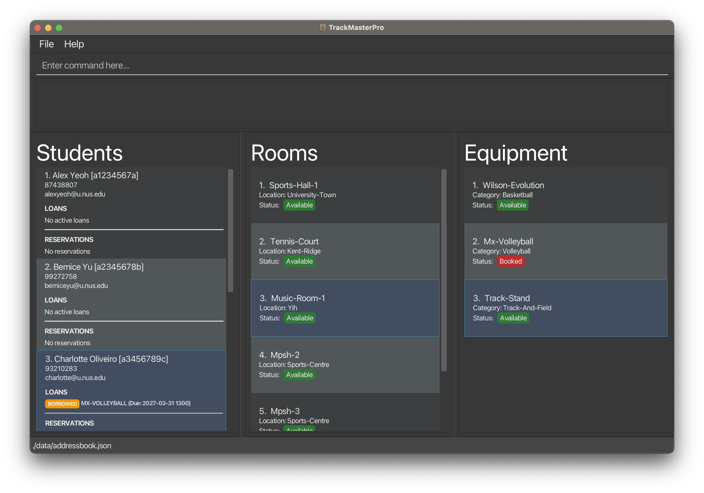
   
   4. Type the command in the command box and press Enter to execute it. e.g., typing **`help`** and pressing Enter will show all the command in the result box.
   
   Some example commands you can try:

   * `add-s n/John Doe m/A0123456B p/91234567 e/e0123456@u.nus.edu` : Adds a new student with the name `John Doe`, matric number `A0123456B`, phone number `91234567` and email address `e0123456@u.nus.edu`.

   * `edit-r 2 n/Outdoor-Tennis-Court` : Edits the room in the second index of room list to a name `Outdoor-Tennis-Court`.

   * `add-r n/Outdoor-Basketball-Court l/Kent-Ridge` : Adds a new room with name `Outdoor-Basketball-Court`, location `Kent-Ridge`, and a `Available` status by default.
   
   * `delete-e 2` : Deletes the second equipment shown in the equipment list.

   * `exit` : Exits the app.

5. Refer to the [Features](#features) below for details of each command.

--------------------------------------------------------------------------------------------------------------------

## 2. Features

**:information_source: Notes about the command format:** 

* Words in `UPPER_CASE` are the parameters to be supplied by the user. 
  e.g., in `add-s n/NAME`, `NAME` is a parameter which can be used as `add-s n/John-Doe`.

* Items in square brackets are optional. 
  e.g., `n/NAME [t/TAG]` can be used as `n/John-Doe t/friend` or as `n/John-Doe`.

* Items with `…` after them can be used multiple times including zero times. 
  e.g., `[t/TAG]…` can be used as many times (i.e. 0 times), `t/ICG`, `t/IFG t/CareerFest` etc.

* Parameters with prefixes can be in any order(eg. n/,p/). 
  e.g., if the command specifies `n/NAME p/PHONE_NUMBER`, `p/PHONE_NUMBER n/NAME` is also acceptable.

* If you are using a PDF version of this document, be careful when copying and pasting commands that span multiple lines as space characters surrounding line-breaks may be omitted when copied over to the application.

---

### 2.1 Equipment Management

#### Adding an equipment : `add-e`

Adds a new piece of physical equipment into the inventory so it can be tracked and loaned.
New equipment is set to `Available` status by default.

**Format:** `add-e n/NAME c/CATEGORY`

**Acceptable values:**
* `NAME`: Equipment Name should only contain alphanumeric characters and single hyphens (`-`) in between,
  no spaces or consecutive hyphens (`--`) are allowed, and it should not be blank. (e.g., `Wilson-Evolution`)
* `CATEGORY`: Equipment Category should only contain alphanumeric characters and single hyphens (`-`) in between,
  no spaces or consecutive hyphens (`--`) are allowed, and it should not be blank. (e.g., `Basketball`)   
* *Case Sensitivity:* Both fields are case-insensitive. `n/Wilson-Evolution` and `n/WILSON-EVOLUTION` are treated as the same name. `c/Basketball` and `c/BASKETBALL` are treated as the same category.

**Duplicate handling:**
* The system enforces unique names across the equipment list.

:bulb: **Tip:**
To add multiple Equipment of the same name, append a unique number (e.g., `Wilson-Evolution-1`, `Wilson-Evolution-2`).

**Examples:**
* `add-e n/Tchoukball-Frame c/Tchoukball` — Adds an equipment with Name: Tchoukball-Frame, Category: Tchoukball, and a `Available` status by default in the current equipment list.
* `add-e n/Yonex-Astrox c/Badminton` — Adds an equipment with Name: Yonex-Astrox, Category: Badminton, and a `Available` status by default in the current equipment list.
* `add-e n/Decathlon-Soccer-Ball c/Soccer` — Adds an equipment with Name: Decathlon-Soccer-Ball, Category: Soccer, and a `Available` status by default in the current equipment list.

**Outputs:**

:bulb: **Tip:**
Output of Name and Category will be title case -> `yonex-astrox` will be `Yonex-Astrox` in the equipment list.

* Success  
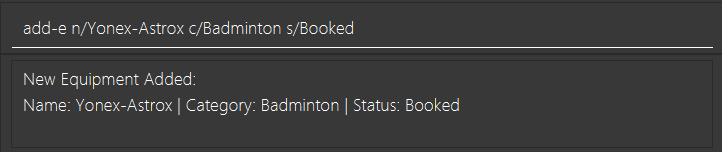
* Failure  
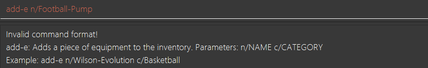

**Possible errors:**
* *Invalid command:* Missing `n/` and `c/` prefix.
* *Invalid name/category:* Using spaces, special characters (e.g., `#`, `@` etc.), or leaving fields blank.
* *This equipment already exists:* Attempting to add a name that is already in the inventory.

---

#### View equipment list : `list-e`

Displays a complete list of all equipment currently stored in the equipment list. This command serves to clear 
any active filters (such as those from filter-e command), resetting the equipment list to show all entries.

**Format:** `list-e`

**Acceptable values:**
* Only accepts `list-e`.

**Duplicate handling:**
* Not applicable for a view command.

**Examples:**
* `list-e` — Resets the view of equipment list and displays all equipment.

**Outputs:**
* Success  
  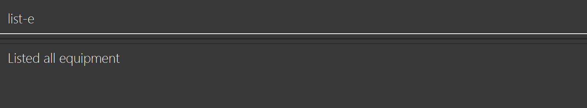
* Failure  
  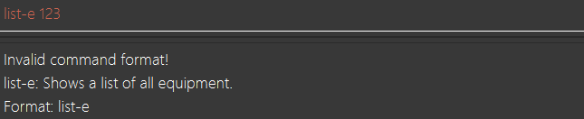

**Possible errors:**
* Inventory list has not been created.
* Any extra input after `list-e`, (e.g., `list-e Basketball`, `list-e 123` etc.) will be invalid command.

---

#### Delete equipment from equipment list : `delete-e`

Deletes equipment from the equipment list.

**Format:** `delete-e INDEX`

**Acceptable values:**
* `INDEX`: Positive integer corresponding to the current displayed list from `list-e`. (e.g., `list-e` have a size of 4, valid index range would be 1, 2, 3, or 4)

:warning: **Warning:**
**Strict Lockdown:** You cannot delete equipment that currently has a **Booked** status. The equipment must be returned or canceled before it can be deleted from the system.

**Duplicate handling:**
* Not applicable for a delete command.

**Examples:**
* `delete-e 1` — Deletes the first equipment in the current equipment list.
* `delete-e 4` — Deletes the fourth equipment in the current equipment list.

**Outputs:**
* Success  
  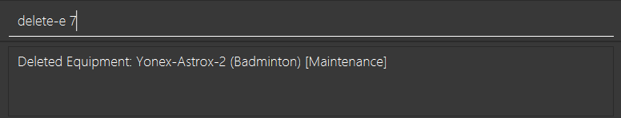
* Failure  
  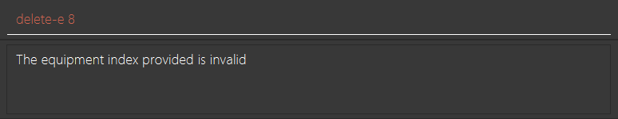

**Possible errors:**
* *Invalid index:* The index provided is 0, negative or exceeds the current equipment list index.
* *Invalid command format:* Typing delete-e without providing an index.
* *Equipment is Booked:* Attempt to delete equipment that is having a ‘Booked’ status.

---

#### Edit equipment from equipment list : `edit-e`

Edit details for existing equipment from the equipment list.

**Format:** `edit-e INDEX [n/NAME] [c/CATEGORY] [s/STATUS]`

**Acceptable values:**
* `INDEX`: Positive integer corresponding to the current displayed list from `list-e`. (e.g., `list-e` have a size of 4, valid index range would be 1, 2, 3, or 4).
* *(With at least one of the fields)*
    * `NAME`: Equipment Name should only contain alphanumeric characters and single hyphens (`-`) in between,
      no spaces or consecutive hyphens (`--`) are allowed, and it should not be blank. (e.g., `Wilson-Evolution`)
    * `CATEGORY`: Equipment Category should only contain alphanumeric characters and single hyphens (`-`) in between,
      no spaces or consecutive hyphens (`--`) are allowed, and it should not be blank. (e.g., `Basketball`)
    * `STATUS`: If status is `Available`, it can only be changed to `Maintenance` or `Damaged`. If status is `Maintenance` or `Damaged`, it can only be changed back to `Available`.

:warning: **Warning:**
**Strict Lockdown:** You cannot edit equipment that currently has a **Booked** status. The equipment must be returned or canceled before it can be edited.

**Duplicate handling:**
* The system enforces unique names across the Equipment inventory list.

:bulb: **Tip:**
To add multiple Equipment of the same name, append a unique number (e.g., `Wilson-Evolution-1`, `Wilson-Evolution-2`).

**Examples:**
* `edit-e 1 s/Maintenance` — Edit the first equipment to Status: Maintenance. Assuming initial status is Available.
* `edit-e 3 n/Wilson-Evo c/Bball s/Available` — Edit the third equipment to Name: Wilson-Evo, Category: Bball, Status: Available. Assuming initial status is Maintenance.

**Outputs:**

:bulb: **Tip:**
Output of Name and Category will be title case -> `yonex-astrox` will be `Yonex-Astrox` in the equipment list.

* Success  
  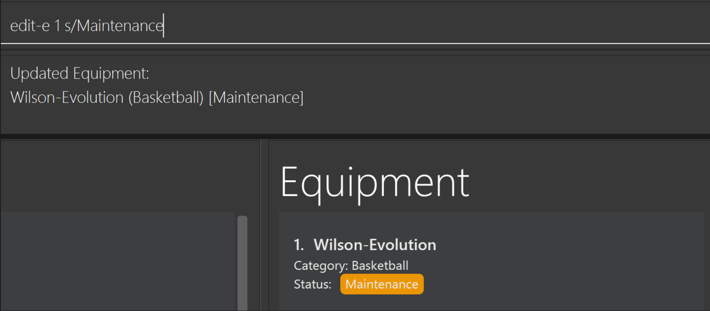
* Failure  
  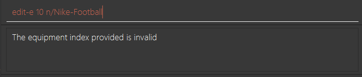

**Possible errors:**
* *This equipment is currently 'Booked':* Attempting to edit a loaned equipment.
* *This equipment already exists:* Renaming equipment to a name already in use.
* *Invalid status transition:* Trying to move an equipment status from Maintenance to Booked.
* *Invalid command:* Missing `n/`, `c/`, or `s/` prefix.

---

### 2.2 Facility & Venue Management

#### Adding a room (facility or venue) : `add-r`

Adds a new room (facility or venue) into the room list.
New room is set to `Available` status by default.

**Format:** `add-r n/NAME l/LOCATION`

**Acceptable values:**
* `NAME`: Room Name should only contain alphanumeric characters and single hyphens (`-`) in between,
  no spaces or consecutive hyphens (`--`) are allowed, and it should not be blank. (e.g., `Sports-Hall-1`)
* `LOCATION`: Room Location should only contain alphanumeric characters and single hyphens (`-`) in between,
  no spaces or consecutive hyphens (`--`) are allowed, and it should not be blank. (e.g., `University-Town`)   
* *Case Sensitivity:* Both fields are case-insensitive. `n/Sports-Hall-1` and `n/SPORTS-HALL-1` are treated as the same name. `l/University-Town` and `l/UNIVERSITY-TOWN` are treated as the same location.

**Duplicate handling:**
* The system enforces unique names across the room list.

:bulb: **Tip:**
To add multiple Room of the same name, append a unique number (e.g., `Sports-Hall-1`, `Sports-Hall-2`).

**Examples:**
* `add-r n/MPSH-2 l/Sports-Centre` — Adds a room with Name: Mpsh-2 and Location: Sports-Centre, and a `Available` status by default in the current room list.
* `add-r n/Sports-Hall-2 l/University-Town` — Adds a room with Name: Sports-Hall-2 and Location: University-Town, and a `Available` status by default in the current room list.

**Outputs:**

:bulb: **Tip:**
Output of Name and Location will be title case -> `MPSH-1` will be `Mpsh-1` in the room list.

* Success  
  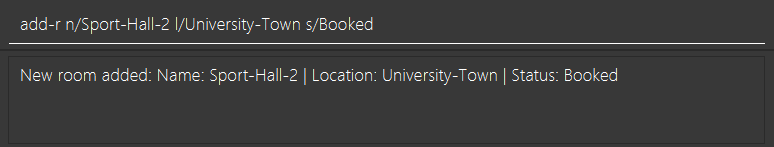
* Failure  
  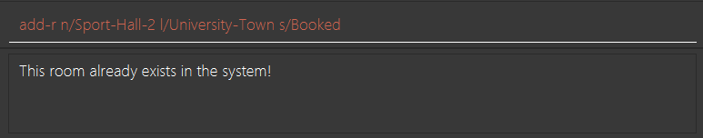

**Possible errors:**
* *Invalid command:* Missing `n/` and `l/` prefix.
* *Invalid name/location:* Using spaces, special characters (e.g., `#`, `@` etc.), or leaving fields blank.
* *This room already exists:* Attempting to add a name that is already in the inventory.

---

#### View room list : `list-r`

Displays a complete list of all facilities and venue currently stored in the room list. This command serves to clear
any active filters (such as those from filter-r command), resetting the room list to show all entries.

**Format:** `list-r`

**Acceptable values:**
* Only accepts `list-r`.

**Duplicate handling:**
* Not applicable for a view command.

**Examples:**
* `list-r` — Resets the view of room list and displays all facilities and venue.

**Outputs:**
* Success  
  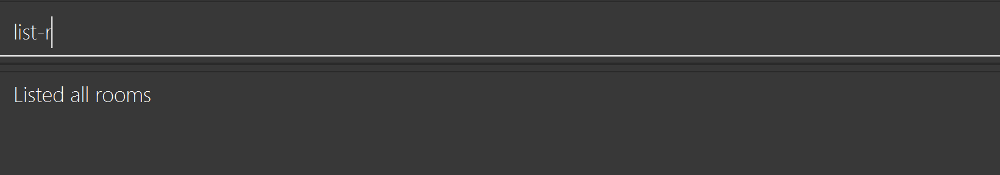
* Failure  
  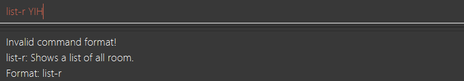

**Possible errors:**
* Room list has not been created.
* Any extra input after `list-r`, (e.g., `list-r Sports-Hall`, `list-r YIH` etc.) will be invalid command.

---

#### Delete a room from room list: `delete-r`

Deletes a room from the room list.

**Format:** `delete-r INDEX`

**Acceptable values:**
* `INDEX`: Positive integer corresponding to the current displayed list from `list-r`. (e.g., `list-r` have a size of 4, valid index range would be 1, 2, 3, or 4)

:warning: **Warning:**
**Strict Lockdown:** You cannot delete room that currently has a **Booked** status. The room must be canceled before it can be deleted from the room list.

**Duplicate handling:**
* Not applicable for a delete command.

**Examples:**
* `delete-r 1` — Deletes the first room in the current room list.
* `delete-r 8` — Deletes the eighth room in the current room list.

**Outputs:**
* Success  
  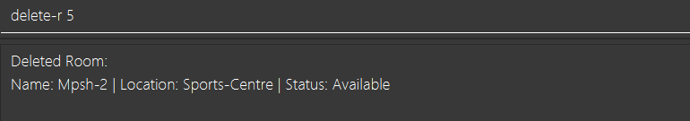
* Failure  
  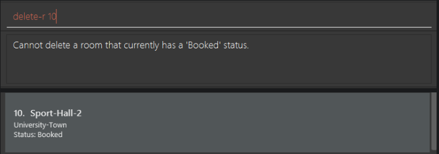

**Possible errors:**
* *Invalid index:* The index provided is 0, negative or exceeds the current room list index.
* *Invalid command format:* Typing delete-r without providing an index.
* *Room is Booked:* Attempt to delete room that is having a ‘Booked’ status.

---

#### Edit room from room list : `edit-r`

Edit details for existing room from the room list.

**Format:** `edit-r INDEX [n/NAME] [l/LOCATION] [s/STATUS]`

**Acceptable values:**
* `INDEX`: Positive integer corresponding to the current displayed list from `list-r`. (e.g., `list-r` have a size of 4, valid index range would be 1, 2, 3, or 4)
* *(With at least one of the fields)*
    * `NAME`: Room Name should only contain alphanumeric characters and single hyphens (`-`) in between,
      no spaces or consecutive hyphens (`--`) are allowed, and it should not be blank. (e.g., `Sports-Hall-1`)
    * `LOCATION`: Room Location should only contain alphanumeric characters and single hyphens (`-`) in between,
      no spaces or consecutive hyphens (`--`) are allowed, and it should not be blank. (e.g., `University-Town`)
    * `STATUS`: If status is `Available`, it can only be changed to `Maintenance`. If status is `Maintenance`, it can only be changed to `Available`.

:warning: **Warning:**
**Strict Lockdown:** You cannot edit room that currently has a **Booked** status. The room must be canceled before it can be edited.

**Duplicate handling:**
* The system enforces unique names across the room list.

:bulb: **Tip:**
To add multiple Room of the same name, append a unique number (e.g., `Sports-Hall-1`, `Sports-Hall-2`).

**Examples:**
* `edit-r 2 l/UTown` — Edit the second room to Location: UTown.
* `edit-r 3 n/Tennis-Court s/Maintenance` — Edit the third room to Name: Tennis-Court, and Status: Maintenance. Assuming initial status is Available.

**Outputs:**

:bulb: **Tip:**
Output of Name and Location will be title case -> `MPSH-1` will be `Mpsh-1` in the room list.

* Success  
  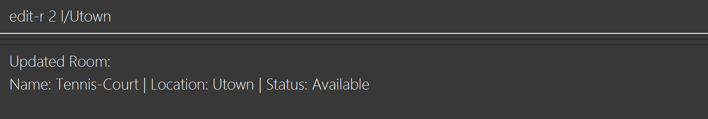
* Failure  
  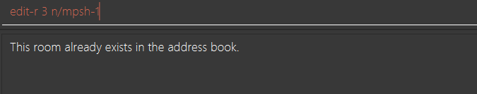

**Possible errors:**
* *This room is currently 'Booked':* Attempting to edit a reserved room.
* *This room already exists:* Renaming room to a name already in use.
* *Invalid status transition:* Trying to move a room status from Maintenance to Booked.
* *Invalid command:* Missing `n/`, `c/`, or `s/` prefix.

---

### 2.3 Borrower Management

#### Adding a new student profile : `add-s`

Adds a new student in the database so they can begin borrowing equipment or booking room/facility.

**Format:** `add-s n/NAME m/MATRIC_NUMBER p/PHONE_NUMBER e/EMAIL`

**Acceptable values:**
* `NAME`: Alphabets and internal spaces only (e.g., `John Lim`). No special characters or numbers (e.g., `-`, `.`, `*`). The system trims any spaces at the very beginning or end of a name.
* `MATRIC_NUMBER`: Must be exactly 9 characters long. Starts with a letter (usually 'A'), followed by 7 digits, and ends with a check letter. (e.g., `A0123456B`). Case insensitive.
* `PHONE_NUMBER`: 8-digit mobile number (e.g., `81234567`).
* `EMAIL`: Valid email format (e.g., `e0123456@u.nus.edu`). Case insensitive.

**Duplicate handling:**
* To ensure data integrity, each Student must have a unique `MATRIC_NUMBER`, `PHONE_NUMBER`, and `EMAIL`. If any of these are already registered to another student, the command will fail.  

**Examples:**
*  `add-s n/John Doe m/A0123456B p/91234567 e/e0123456@u.nus.edu` — Adds a new student with the name `John Doe`, matric number `A0123456B`, phone number `91234567` and email address `e0123456@u.nus.edu`.

**Outputs:**

* Success  
  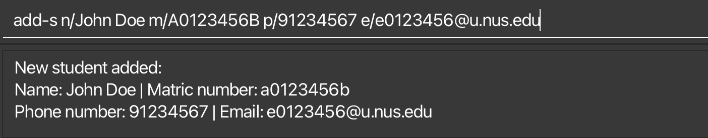
* Failure  
  

**Possible errors:**
* *Invalid command*: Missing any of `n/`, `m/`, `p/`, `e/` prefix.
* *Invalid name*: Hyphens `-`, periods `.`, and apostrophes `'`, numbers `1` in name will cause an error.
* *Student already exists*: Attempting to add a student whose `Matric Number`, `Phone Number`, or `Email`are already in the system.

---

#### Check a student's loans : `check-s`

To check the list of equipment or rooms loaned to a student.

**Format:** `check-s MATRIC_NUMBER`

**Acceptable values:**
* `MATRIC_NUMBER`: Must be exactly 9 characters long. Starts with a letter (usually 'A'), followed by 7 digits, and ends with a check letter. (e.g., `A0123456B`). Case insensitive.
* *Case Sensitivity*: Case-insensitive. `A0123456B` and `a0123456b` are treated as the same matric number.

**Duplicate handling:**
* The system searches by the unique matric number, so there is no risk of returning the wrong student's data.

**Examples:**
* `check-s A0123456B`

**Outputs:**
* Success  
  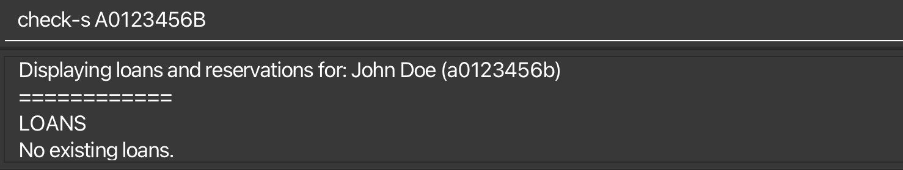
* Failure  
  

**Possible errors:**
* No matric number in the system.
* Invalid matric number format.

---

#### View student list : `list-s`

Displays a list of all registered students in the system.

**Format:** `list-s`

**Acceptable values:**
* Only accepts `list-s`.

**Duplicate handling:**
* Not applicable for a view command.

**Examples:**
* `list-s`.

**Outputs:**
* Success  
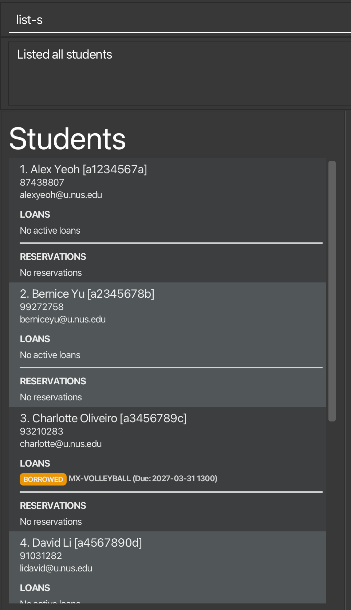

**Possible errors:**
* Any extra input after `list-s`, (e.g., `list-s 1`, `list-e a` etc.) will be invalid command.

---

#### Delete student from student list : `delete-s`

Deletes a student’s record from the system database.

**Format:** `delete-s MATRIC_NUMBER`

**Acceptable values:**
* `MATRIC_NUMBER`: A 9-character identifier. Must start with an alphabet (usually 'A'), followed by 7 digits, and end with an alphabet (e.g., `A0123456B`).
* *Case Sensitivity*: Case-insensitive. `A0123456B` and `a0123456b` are treated as the matric number.

**Examples:**
* `delete-s A0123456B`

**Outputs:**
* Success: 
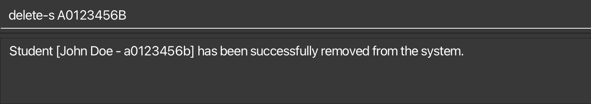

* Failure:
  * Student's matric number not found in system  
  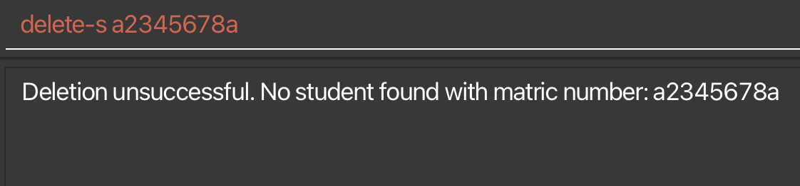
  * Student with existing loans/reservations  
  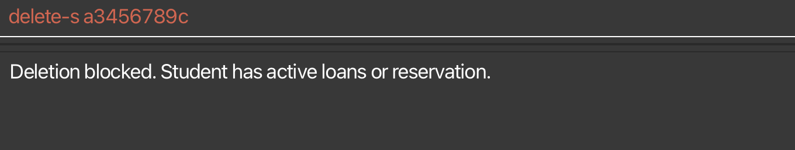

**Possible errors:**
* *Student Not Found*: The matric number entered does not exist in the current database.
* *Active Loans*: Deletion is blocked if the student currently has equipment that has not been returned.
* *Active Reservations*: Deletion is blocked if the student has upcoming room or facility bookings.

:bulb: **Important:**
A student profile **cannot be deleted** if there are outstanding records.
Please ensure all borrowed items are returned and all upcoming reservations are cancelled before attempting to remove the student.

---

#### Edit student from student list : `edit-s`

Edits an existing student's details in the address book.

**Format:** `edit-s INDEX [n/NAME] [m/MATRIC_NUMBER] [p/PHONE_NUMBER] [e/EMAIL]`

**Acceptable values:**
* `INDEX`: Must be a positive integer `(1, 2, 3...)` as shown in the current displayed list.
* Fields: At least one field must be provided.
* (With at least one of the fields)
    * `NAME`: Alphabets and internal spaces only (e.g., `John Lim`). No special characters or numbers (e.g., `-`, `.`, `*`).
    * `MATRIC_NUMBER`: Must be exactly 9 characters long. Starts with a letter (usually 'A'), followed by 7 digits, and ends with a check letter. (e.g., `A0123456B`). Case insensitive.
    * `PHONE_NUMBER`: 8-digit mobile number (e.g., `81234567`).
    * `EMAIL`: Valid email format (e.g., `e0123456@u.nus.edu`).

:bulb: **Important:**
You **cannot** edit any details of a student if they currently have an active equipment loan or a facility reservation.

**Examples:**
* `edit-s 2 n/Tom p/91234561 e/e1234567@u.nus.edu`.

**Outputs**
* Success  
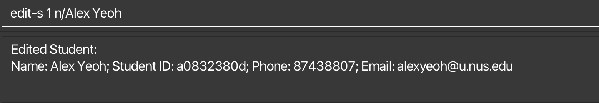

* Failure
  * Missing fields  
  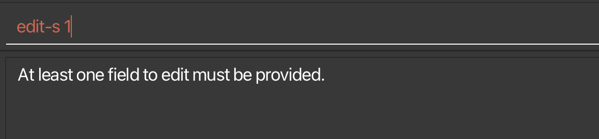

  * Student with existing loans/reservations  
  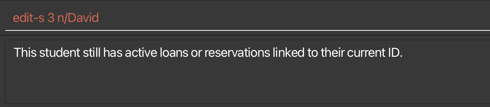

**Possible errors:**
* *Active Loans*: Editing is blocked if the student currently has equipment that has not been returned.
* *Active Reservations*: Editing is blocked if the student has upcoming room or facility bookings.
* *Invalid index*: Index provided is invalid.
* *Duplicated student*: A student with the edited information already exists.

---

### 2.4 Loans & Reservations

#### Reserving a room/equipment: `reserve`

Reserves a room or equipment for a student at a specified date and time.

**Format:** `reserve ITEM_OR_ROOM_ID STUDENT_ID f/START_DATE_TIME t/END_DATE_TIME`

**Date/time format:**
`yyyy-MM-dd HHmm`

:bulb: **Tip:**
You can reserve facilities such as halls, courts, and multi-purpose rooms as well as equipments in advance to avoid double bookings.

* Creates a reservation for the specified item or room under the specified student.
* The start and end date/time must be valid and the end date/time must be later than the start date/time.
* The reservation will be rejected if it conflicts with an existing booking for the same item or room.

:warning: **Warning:**
* Reservation can only be made when the room status is **Available**.
* A room or equipment can only have **one active reservation** at a time.

**Duplicate handling:**
* Duplicate or overlapping reservations are not allowed.
* If the specified item or room is already reserved for the requested time period, the command will be rejected.

**Examples:**
* `reserve MPSH-1 a1234567a f/2027-03-10 0900 t/2027-03-10 1200`

**Outputs:**
* Success  
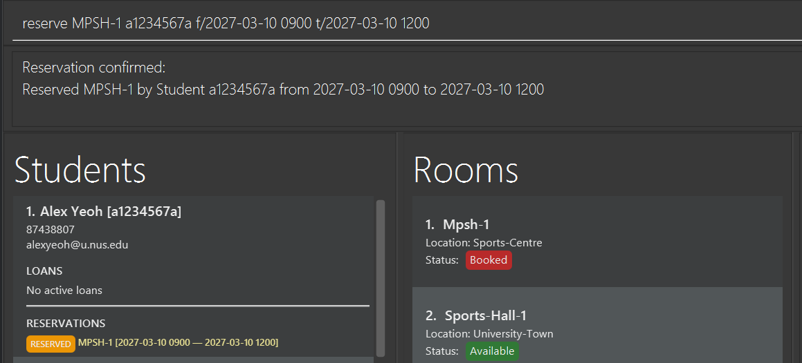

* Failure  
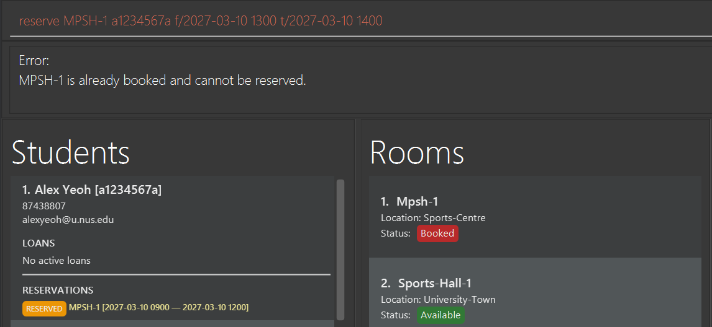
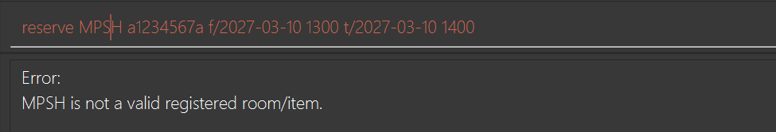

**Possible errors:**
* Invalid `ITEM_OR_ROOM_ID`
* Invalid `STUDENT_ID`
* Invalid date/time format
* End time is earlier than start time

---

#### Cancel a reservation: `cancel`

Cancels an **existing** reservation.

**Format:**
`cancel ITEM_OR_ROOM_ID STUDENT_ID f/START_DATE_TIME`

**Date/time format:**
`yyyy-MM-dd HHmm`

**Example:**
`cancel MPSH-1 a1234567a f/2027-03-10 0900`

**Outputs:**

* Success  
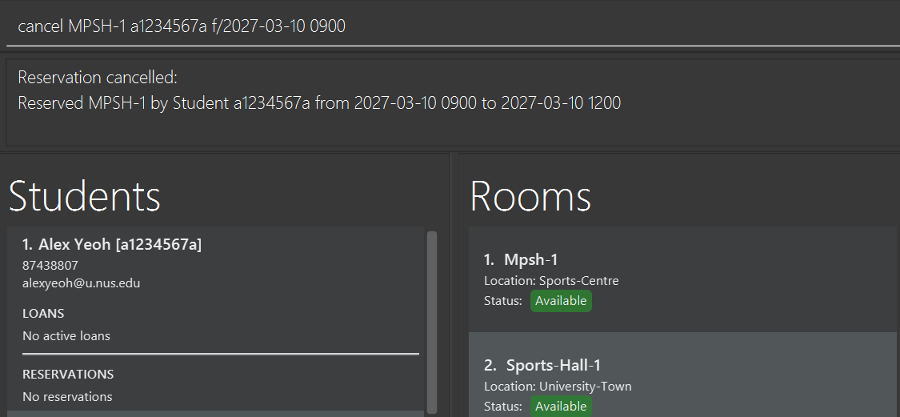

* Failure  
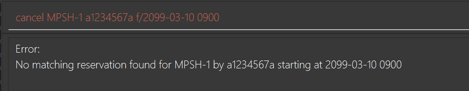

---

#### Issuing an equipment item: `issue`

Issues an equipment item to a student with a due date and time for return.

**Format:** `issue ITEM_ID STUDENT_ID DUE_DATE_TIME`

:bulb: **Tip:**
Use this command to keep track of borrowed equipment and who is responsible for returning it.

* Issues the specified equipment item to the specified student.
* The due date/time must be in the future and follow the format `yyyy-MM-dd HHmm`.
* The command will be rejected if the item is already issued to another student.

**Duplicate handling:**
* If the item is already issued, the system will reject the command.
* The system will show the current holder of the item and its due date/time.

**Examples:**
* `issue Wilson-Evolution a1234567a 2027-03-05 1700`

**Outputs:**
* Success  
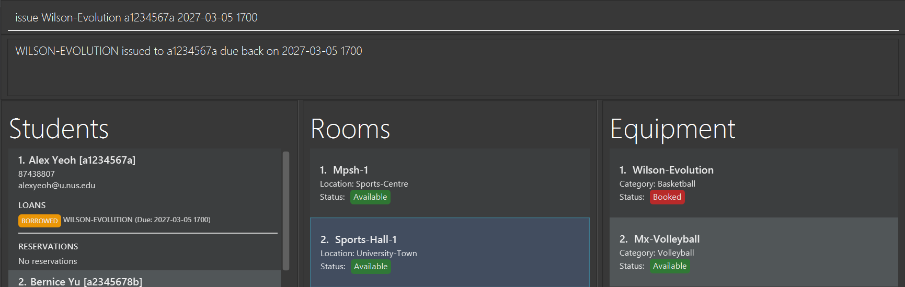

* Failure  
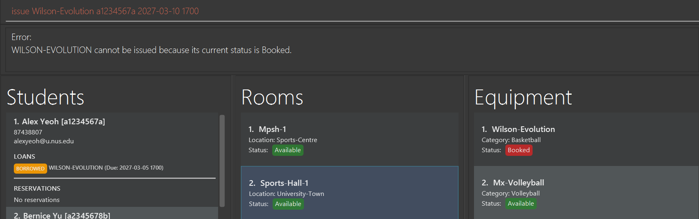

**Possible errors:**
* Invalid `ITEM_ID`
* Invalid `STUDENT_ID`
* Item is already issued
* Invalid due date/time format
* Due date/time is in the past

---

#### Return an equipment: `return`

Returns an issued equipment item back to the inventory.

**Format:**
`return ITEM_ID`

**Example:**
`return Wilson-Evolution`

**Outputs:**
* Success  
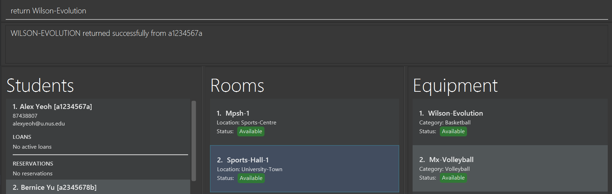

* Failure  
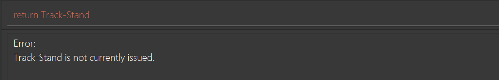

**Possible errors:**
* Item not currently issued
* Invalid `ITEM_ID`

**Notes**
- aliases are supported, so if `b1` is an alias for `Wilson-Evolution-Basketball-1`, then `return b1` also works

---

#### Creating an alias: `alias`

Creates a short alias for an equipment item or room.

**Format:** `alias ITEM_OR_ROOM_ID ALIAS_NAME`

:bulb: **Tip:**
Aliases are useful for long item or room IDs, especially during busy periods when faster command entry is helpful.

* Assigns a short alias to the specified item or room.
* `ALIAS_NAME` should be a short string containing letters, numbers, or underscores.
* Each alias must be unique across the system.
* Only works for reservation , issue, cancel, return commands.

**Duplicate handling:**
* Duplicate aliases are not allowed.
* If the alias is already in use, the command will be rejected.

**Examples:**
* `alias MPSH-1 hall1`

**Outputs:**

* Success  
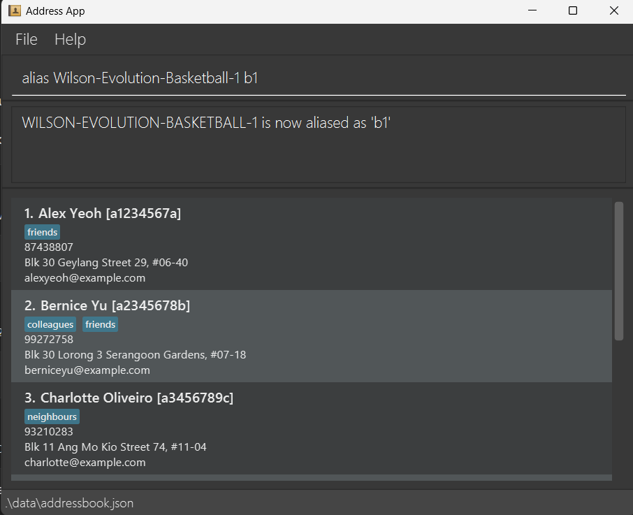

* Failure  
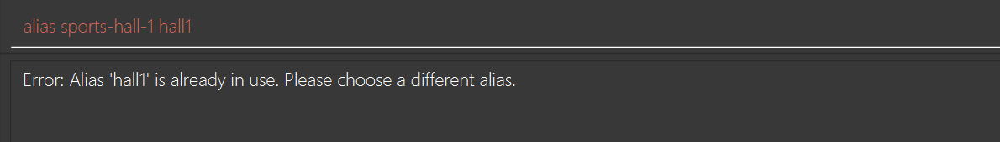

**Possible errors:**
* Invalid `ITEM_OR_ROOM_ID`
* Alias already exists.

---

### 2.5 Tag & Filter

#### Tagging an equipment or room: `tag-e` or `tag-r`

Tags an equipment item or room with a label for categorisation.
`tag-r` targets rooms. `tag-e` targets equipments.

**Format:** `tag-e NAME TAG` or `tag-r NAME TAG`

:bulb: **Tip:**
Tags are useful for categorising equipment or rooms for quick viewing, and will be displayed in the UI as a blue label

:bulb: **Tip for IHG:**
Tag equipment as `t/IHG` during competition weeks to quickly filter items that should not be loaned out for casual use.

**Acceptable values:**
* `NAME`: Equipment or room name should only contain alphanumeric characters and single hyphens (`-`) in between,
  no spaces or consecutive hyphens (`--`) are allowed, and it should not be blank. (e.g., `Sports-Hall-1`, `Basketball-1`)
* `TAG`: should only contain alphanumeric characters, not allowing punctuation or spaces. It is not case-sensitive, and should not be blank.
* The system will detect and warn against duplicate tags.

**Duplicate handling:**
* Duplicate tags on the same equipment or room are not allowed.
* If the tag already exists on the item or room, the command will be rejected.

**Examples:**
* `tag-e Wilson-Evolution-Basketball-1 IHG` 
* `tag-r MPSH-1 IHG` 

**Outputs:**
* Success  

* Failure  

**Possible errors:**
* *Invalid command:* Extra input.
* *Invalid name/tag:* Using spaces, special characters (e.g., `#`, `@` etc.), or leaving fields blank.
* *The tag already exists on room/equipment:* Attempting to add a duplicate tag.

---

#### Removing a tag from an equipment or room: `untag-e` or `untag-e`

Removes an existing tag from an equipment item or room.

**Format:** `untag-e NAME TAG` or `untag-r NAME TAG`

:bulb: **Tip:**
Use this command to remove outdated or incorrect tags from equipment or rooms.

**Acceptable values:**
* `NAME`: Equipment or room name should only contain alphanumeric characters and single hyphens (`-`) in between,
  no spaces or consecutive hyphens (`--`) are allowed, and it should not be blank. (e.g., `Sports-Hall-1`, `Basketball-1`)
* `TAG`: should only contain alphanumeric characters, not allowing punctuation or spaces. It is not case-sensitive, and should not be blank.
* `untag-r` targets rooms. `untag-e` targets equipments.
* The command will be rejected if the specified tag does not exist on the item or room.

**Duplicate handling:**
* Not applicable.

**Examples:**
* `untag-e Wilson-Evolution-Basketball-1 IHG` 
* `untag-r MPSH-1 IHG`

**Outputs:**
* Success  

* Failure  
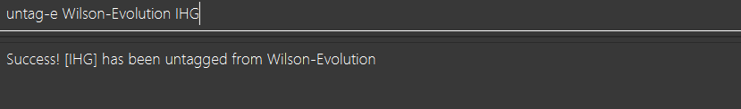

**Possible errors:**
* *Invalid command:* Extra input.
* *Invalid name/tag:* Using spaces, special characters (e.g., `#`, `@` etc.), or leaving fields blank.
* *The tag does not exist on room/equipment:* Attempting to delete non-existent tag.

---

#### Filtering by tag: `filter-e` or `filter-r`

Filters equipment items or rooms by a specified tag. Displays all equipment items or rooms that have the specified tag.

**Format:** `filter-r TAG` or `filter-e TAG`

:bulb: **Tip:**
Use this command to quickly find all equipment or rooms associated with a particular tag, such as all items marked as spoilt.

**Acceptable values:**
* `TAG`: should only contain alphanumeric characters, not allowing punctuation or spaces. It is not case-sensitive, and should not be blank.
* `filter-r` targets rooms. `filter-e` targets equipments.

**Duplicate handling:**
* Not applicable.

**Examples:**
* `filter-r IHG`
* `filter-e IHG`

**Outputs:**
* Success  
  
* Failure  
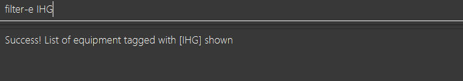

**Possible errors:**
* *Invalid command:* Missing `t/` prefix.
* *Nothing tagged:* No equipment or rooms found with the specified tag

### 2.6 System Utilities

#### Viewing help : `help`

Shows a message explaining how to access the help page.

Format: `help`

---

#### Clearing the program : `clear`

Clears the program.

Format: `clear`

---

#### Exiting the program : `exit`

Exits the program.

Format: `exit`

---

## 3. Data Management
### Automatic Saving

TrackMasterPro data is saved in the local storage automatically after any command that changes the data. There is no need to save manually.

### Manual Data Editing

TrackMasterPro data is saved automatically as a JSON file `[JAR file location]/data/addressbook.json`. Advanced users are welcome to update data directly by editing that data file.

:exclamation: **Caution:**
If your changes to the data file makes its format invalid, TrackMasterPro will discard all data and start with an empty data file at the next run. Hence, it is recommended to take a backup of the file before editing it. 
Furthermore, certain edits can cause the TrackMasterPro to behave in unexpected ways (e.g., if a value entered is outside of the acceptable range). Therefore, edit the data file only if you are confident that you can update it correctly.

--------------------------------------------------------------------------------------------------------------------

## 4. FAQ

**Q**: How do I transfer my data to another Computer? 
**A**: Install the app in the other computer and overwrite the empty data file it creates with the file that contains the data of your previous TrackMasterPro home folder.

--------------------------------------------------------------------------------------------------------------------

## 5. Known issues

1. **When using multiple screens**, if you move the application to a secondary screen, and later switch to using only the primary screen, the GUI will open off-screen. The remedy is to delete the `preferences.json` file created by the application before running the application again.

2. **If you minimize the Help Window** and then run the `help` command (or use the `Help` menu, or the keyboard shortcut `F1`) again, the original Help Window will remain minimized, and no new Help Window will appear. The remedy is to manually restore the minimized Help Window.

3. **Strict Name Validation:** The current system only accepts alphabetic characters and spaces for student names. Names containing special characters such as hyphens (e.g., `Al-Haddad`) or apostrophes (e.g., `D'Souza`) will currently trigger a validation error.
**Workaround**: Enter the name without the special character (e.g., `Al Haddad` or `DSouza`) until a future update expands the character support. Removing special characters from the requirements allows for faster command entry and fewer parsing errors during high-pressure facility management scenarios

4. **UI Refresh Latency:** The student list does not refresh in real-time when a reservation or equipment loan becomes overdue. While the system correctly identifies the status change in the database, the Graphical User Interface (GUI) may still show the old status (e.g., "Booked" instead of "Overdue").
**Workaround:*** Simply click anywhere within the application window to force the UI to refresh and display the most current statuses.

--------------------------------------------------------------------------------------------------------------------

## 6. Command summary

Action | Format, Examples
--------|------------------
**Add Equipment** | `add-e n/NAME c/CATEGORY`   e.g., `add-e n/Wilson-Evolution c/Basketball`
**List Equipment** | `list-e`
**Delete Equipment**| `delete-e INDEX`   e.g., `delete-e 3`
**Edit Equipment** | `edit-e INDEX [n/NAME] [c/CATEGORY] [s/STATUS]`   e.g., `edit-e 6 n/Wilson-Evo`
**Add Room** | `add-r n/NAME l/LOCATION`   e.g., `add-r n/MPSH-2 l/Sports-Centre`
**List Rooms** | `list-r`
**Delete Room** | `delete-r INDEX`   e.g., `delete-r 1`
**Edit Room** | `edit-r INDEX [n/NAME] [l/LOCATION] [s/STATUS]`   e.g., `edit-r 3 n/Tennis-Court s/Maintenance`
**Add Student** | `add-s n/NAME m/MATRIC_NUMBER p/PHONE_NUMBER e/EMAIL`   e.g., `add-s n/John Doe m/A0123456B p/91234567 e/e0123456@u.nus.edu`
**Check Loans** | `check-s MATRIC_NUMBER`   e.g., `check-s A0123456B`
**List Students** | `list-s`
**Delete Student** | `delete-s MATRIC_NUMBER`   e.g., `delete-s A0123456B`
**Edit Student** | `edit-s INDEX [n/NAME] [m/MATRIC_NUMBER] [p/PHONE_NUMBER] [e/EMAIL]`   e.g., `edit-s 2 m/a1234567b n/Tom p/91234561 e/e1234567@u.nus.edu`
**Reserve** | `reserve ITEM_OR_ROOM_ID STUDENT_ID f/START_DATE_TIME t/END_DATE_TIME`   e.g., `reserve mpsh-1 a1234567a f/2027-03-01 1400 t/2027-03-01 1600`
**Cancel** | `cancel ITEM_OR_ROOM_ID STUDENT_ID f/START_DATE_TIME`   e.g., `cancel mpsh-1 a1234567a f/2099-03-15 0900`
**Issue** | `issue ITEM_ID STUDENT_ID DUE_DATE_TIME`   e.g., `issue Wilson-Basketball-1 a1234567a 2027-03-05 1700`
**Return** | `return ITEM_ID`   e.g., `return Wilson-Evolution-Basketball-1`
**Tag** | `tag NAME TAG`   e.g., `tag-e Basketball-1 IHG or tag-r MPSH-1 IHG`
**Untag** | `untag NAME TAG`   e.g., `untag-e Basketball-1 IHG or untag-r MPSH-1 IHG`
**Filter** | `filter TAG`   e.g., `filter-e IHG or filter-r IHG`
**Alias** | `alias ITEM_OR_ROOM_ID ALIAS_NAME`   e.g., `alias MPSH-1 hall1`
**Clear** | `clear`
**Exit** | `exit`

